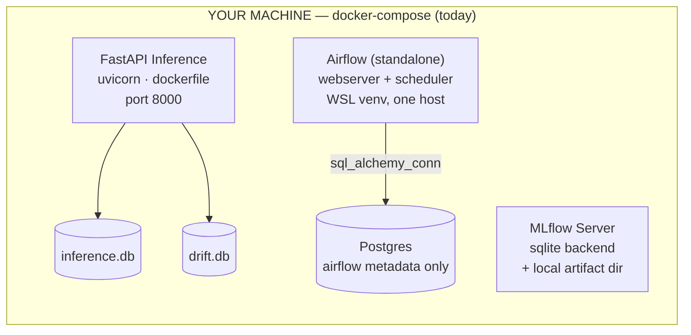
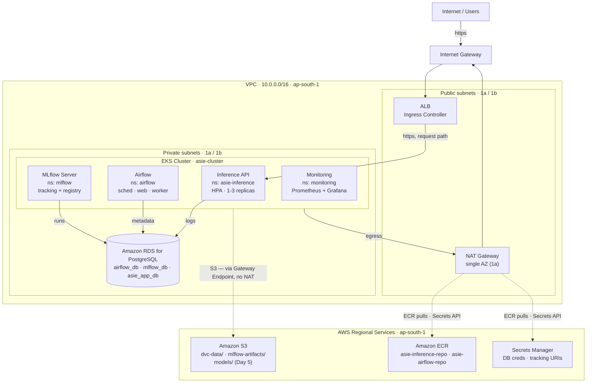

# ASIE — AWS Target Architecture

**Week 11 · Day 1 of 7 — AWS Architecture Planning**
Region: `ap-south-1` · Status: Active · 2026-08-10 · Last updated 2026-08-11 (Day 2 provisioned)

Moving ASIE off a single-host Docker Compose setup onto a fully AWS-hosted platform — inference serving, orchestration, and monitoring all running in-cluster, nothing left on a laptop.

## Contents

- [§1 Context](#1-context)
- [§2 Current State](#2-current-state)
- [§3 Target Architecture](#3-target-architecture)
- [§4 Service Mapping](#4-service-mapping)
- [§5 Migration Plan](#5-migration-plan)
- [§6 Networking Decisions](#6-networking-decisions)
- [§7 Open Items](#7-open-items)

---

## §1 Context

Weeks 1–10 built ASIE as a set of containers on one machine, coordinated by `docker-compose.yaml`: a FastAPI inference service, a standalone Airflow process for retraining, an MLflow tracking server, and a Postgres container that exists only to give Airflow somewhere to write metadata. Everything else — inference logs, drift scores, the model registry — lives in local SQLite files or a hand-edited YAML.

The brief for this migration is to run the whole system on AWS, **self-hosted** rather than farmed out to managed equivalents for Airflow and monitoring — reusing the EKS cluster and Helm tooling already being built for serving, instead of adding Amazon MWAA or Managed Prometheus/Grafana as separate billed services. Region is **ap-south-1**, chosen for cost and proximity.

---

## §2 Current State

What exists today, for reference against the target below.

Every service is a container (or, for Airflow, a bare process) on one machine. State lives in local SQLite files and a hand-edited `model_registry.yaml` — none of it survives a second replica, a redeploy, or a fresh clone. DVC has no configured remote and Terraform state is local-only, so even the infrastructure-as-code can't reproducibly rebuild this.

---

## §3 Target Architecture

Self-hosted end to end on one EKS cluster: inference, Airflow, MLflow, and the monitoring stack all run as workloads in the same cluster, backed by a shared RDS instance and one S3 bucket. Only the load balancer and NAT egress touch the public internet.

Four workloads share one EKS cluster instead of four separate services. The only line that changes behavior from today's system is the **S3 line bypassing NAT** via a gateway endpoint — free, and it keeps DVC/artifact/model traffic off the metered NAT path. Everything else (ECR pulls, Secrets Manager reads) rides the existing NAT → IGW route.

---

## §4 Service Mapping

What each piece of the local stack becomes, and why it has to change rather than just move.

| Local (docker-compose) | AWS Target | Why it can't just move as-is |
|---|---|---|
| `postgres` — Airflow metadata | RDS PostgreSQL · `airflow_db` | Managed instance survives pod restarts; the container version doesn't. |
| `mlflow` — SQLite backend | MLflow server (EKS) · RDS `mlflow_db` + S3 artifacts | SQLite can't be shared across replicas or survive a redeploy. |
| `airflow` — standalone process | Airflow Helm chart on EKS | Same reasoning, plus it becomes horizontally scalable and restart-safe. |
| FastAPI — `dockerfile` | Helm chart `asie-inference`, image from ECR | Already built (Weeks 3–4); it just needs a real registry behind it. |
| `inference.db` (SQLite) | RDS · `asie_app_db.inference_logs` | SQLite breaks the moment HPA runs more than one replica — each pod gets its own file. |
| `drift.db` (SQLite) | RDS · `asie_app_db.drift_metrics` | Same failure mode as above. |
| `model_registry.yaml` (file) | MLflow Model Registry (RDS-backed) | A hand-edited file with concurrent pod writers is a corruption waiting to happen. |
| `exported_model/` (961 MB, baked into image) | S3 bucket, fetched at pod startup | Keeps the image thin. Scoped to Day 5, noted here for completeness. |
| `data/*.parquet` + DVC (no remote) | S3 bucket as DVC remote | `dvc pull` is currently impossible on a fresh clone or CI runner. |
| `prometheus.yml` / `alerts.yml` / `alertmanager.yml` | kube-prometheus-stack on EKS | `alerts.yml` ports to a PrometheusRule CR almost unchanged. |
| `.env` secrets | Secrets Manager → K8s Secret at deploy | No secret should live in a file that could get committed. |
| `asie-inference:latest` (local image) | ECR: `asie-inference-repo`, `asie-airflow-repo` | A private registry, not a locally-tagged image nothing else can pull. Named `-repo` to match the `ECR_REPO` variable `asie.sh` already uses. |

---

## §5 Migration Plan

Day 1 is this document. Days 2–7 follow the Task Board, with the concrete scope this architecture implies for each.

### Day 2 — Provision AWS Infrastructure ✅ Done (2026-08-11)

- ✅ Tagged both subnet tiers for EKS ownership (`kubernetes.io/cluster/asie-cluster=shared`)
- ✅ New `modules/rds`: instance + subnet group + security group — **with a sequencing deviation**: 5432 is scoped to the two private subnet CIDRs, not the EKS node security group specifically, because that SG doesn't exist until eksctl creates it on Day 3. Still fully private, just broader than the doc originally called for. Tracked in §7 to tighten once the real node SG exists.
- ✅ New S3 bucket (`asie-platform-<account-id>`, versioned, encrypted, public access blocked) + gateway endpoint. The three prefixes aren't provisioned objects — they appear when Day 5 actually writes to them.
- ✅ New ECR repositories — **named `asie-inference-repo` / `asie-airflow-repo`**, not `asie-inference` / `asie-airflow` as originally written here, to match the `ECR_REPO` variable `asie.sh` already uses instead of creating a second repo that script doesn't know about.
- ✅ Dropped `aws_key_pair.asie_auth` and the entire `modules/ec2` (bastion + 2× `t3.medium`) rather than relocating the key — went with the SSM Session Manager option. `eks-cluster.yaml` updated to drop `ssh:` and add `iam.withAddonPolicies.ssm: true`.
- ⏸ S3 backend for Terraform state — deferred. State stays local for now; revisit if this becomes a team project.
- ✅ Applied to `ap-south-1` (2026-08-11) — infrastructure is live. Hit and fixed one bug along the way: the RDS security group's description contained an apostrophe, which AWS rejects. See the Day 2 addendum in Daily Updates for details.

### Day 3 — Deploy Kubernetes Platform

- ✅ Node sizing resolved: `t3.xlarge × 2` (not `t3.large` as originally noted here — `t3.medium`/`t3.large` both cap at 2 vCPU, only RAM differs between them; `t3.xlarge` is the first step that actually adds CPU headroom, 4 vCPU/16GiB per node). `eks-cluster.yaml` updated.
- `eksctl create cluster` with `iam.withOIDC: true`
- Namespaces: `asie-inference`, `airflow`, `mlflow`, `monitoring`
- Install the AWS Load Balancer Controller (the ALB this plan assumes)

### Day 4 — Deploy Existing Services

- `helm install asie-inference` — image and paths now correct after the Day 1 cleanup commit
- `helm install` the official Airflow chart, pointed at RDS `airflow_db`
- Deploy MLflow server, pointed at RDS `mlflow_db` + S3 `mlflow-artifacts/`
- Verify pod-to-pod and pod-to-RDS connectivity end to end

### Day 5 — Migrate Storage and Configuration

- Port both SQLite `schema.sql` files to Postgres-compatible DDL
- `dvc remote add` against the new S3 bucket
- Move `exported_model/` to S3; fetch at pod startup instead of baking into the image
- Slim the inference image: CPU-only torch wheel, drop mlflow/dvc/datasets/pytest from it

### Day 6 — Cloud Monitoring & Observability

- Install kube-prometheus-stack via Helm
- Convert `prometheus/alerts.yml` into a PrometheusRule CR
- Add a ServiceMonitor for the `asie-inference` Service

### Day 7 — End-to-End AWS Validation

- Full inference → drift → alert loop, exercised in-cluster
- Architecture screenshots, README/PDR updates, close out the Task Board

---

## §6 Networking Decisions

Concrete calls, each with the reasoning behind it.

**Reuse the existing VPC.** `modules/network` (10.0.0.0/16, 2 AZs) is already EKS-tagged for ELB roles — only the cluster-ownership tag is missing.

**Single NAT Gateway.** One AZ's worth of egress is an acceptable single point of failure for a budget-conscious project — it stalls egress, it doesn't lose data.

**Add an S3 Gateway Endpoint.** Free, and it removes DVC/MLflow/model traffic from the metered NAT path entirely — the one line in §3 that isn't a straight lift of today's topology.

**One ALB for all ingress.** Path/host routing to the inference API, Grafana, and the Airflow webserver. Four separate LoadBalancer Services would mean four billed ELBs.

**RDS: private only, one SG rule.** Inbound 5432 from the EKS node security group exclusively. No public endpoint, no exceptions. *(As provisioned Day 2: scoped to the private subnet CIDRs instead, since the node SG doesn't exist until Day 3's `eksctl create cluster` — see §7.)*

**Drop the bastion + SSH key pair.** `asie-key-pair.pem.pub` isn't in the repo and breaks Terraform on a fresh clone. SSM Session Manager replaces it — no key material to manage or leak.

**Tag subnets for EKS ownership.** `kubernetes.io/cluster/asie-cluster=shared` on both tiers — required for the node group and load balancer controller to function.

**Defer Multi-AZ RDS.** Single-AZ to start. Promoting to Multi-AZ later is a no-downtime modification, not an architecture change.

---

## §7 Open Items

Flagged now, decided later — none of these block starting Day 2.

- **Tighten the RDS security group.** Provisioned Day 2 scoped to the private subnet CIDRs (10.0.2.0/24, 10.0.4.0/24) rather than the EKS node security group, which doesn't exist until `eksctl create cluster` runs on Day 3. Once it does, swap the RDS SG's ingress rule to reference it directly instead of the broader CIDR range.
- ~~**Node capacity.**~~ Resolved Day 3 — `t3.xlarge × 2`, see §5.
- **IRSA role granularity.** This document shows one role per workload (inference / airflow / mlflow). Exact IAM policy documents get written on Day 2 alongside the S3/RDS Terraform.
- **Secrets delivery.** Starting with plain K8s Secrets populated at deploy time, matching `asie.sh`'s existing style. External Secrets Operator (auto-sync, rotation) is a reasonable later upgrade, not a Day 1 blocker.
- **Airflow DAG delivery.** Git-sync sidecar vs. baking DAGs into the image — decided when the Helm release goes up on Day 4.

---

*ASIE — Automated Sentiment Intelligence Engine · Week 11 · Day 1 — AWS Architecture Planning*
