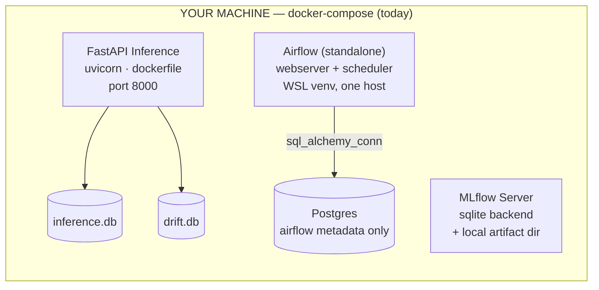
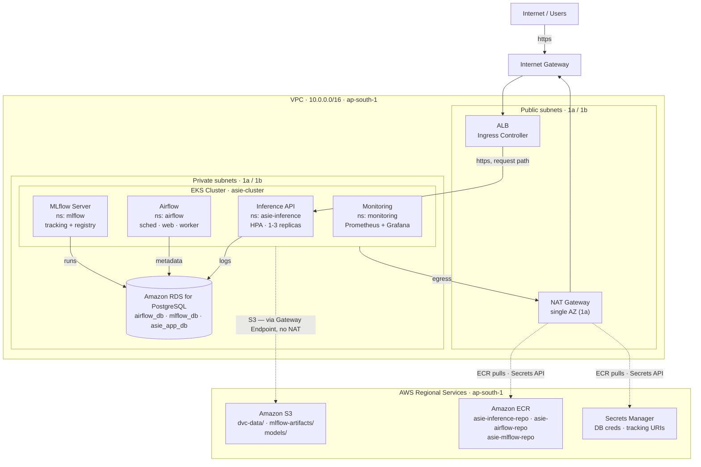

# ASIE — AWS Target Architecture

**Week 11 · Day 1 of 7 — AWS Architecture Planning**
Region: `ap-south-1` · Status: Active · 2026-08-10 · Last updated 2026-08-13 (Days 4+5 in progress)

Moving ASIE off a single-host Docker Compose setup onto a fully AWS-hosted platform — inference serving, orchestration, and monitoring all running in-cluster, nothing left on a laptop.

## Contents

- [§1 Context](#1-context)
- [§2 Current State](#2-current-state)
- [§3 Target Architecture](#3-target-architecture)
- [§4 Service Mapping](#4-service-mapping)
- [§5 Migration Plan](#5-migration-plan)
- [§6 Networking Decisions](#6-networking-decisions)
- [§7 Open Items](#7-open-items)

---

## §1 Context

Weeks 1–10 built ASIE as a set of containers on one machine, coordinated by `docker-compose.yaml`: a FastAPI inference service, a standalone Airflow process for retraining, an MLflow tracking server, and a Postgres container that exists only to give Airflow somewhere to write metadata. Everything else — inference logs, drift scores, the model registry — lives in local SQLite files or a hand-edited YAML.

The brief for this migration is to run the whole system on AWS, **self-hosted** rather than farmed out to managed equivalents for Airflow and monitoring — reusing the EKS cluster and Helm tooling already being built for serving, instead of adding Amazon MWAA or Managed Prometheus/Grafana as separate billed services. Region is **ap-south-1**, chosen for cost and proximity.

---

## §2 Current State

What exists today, for reference against the target below.

Every service is a container (or, for Airflow, a bare process) on one machine. State lives in local SQLite files and a hand-edited `model_registry.yaml` — none of it survives a second replica, a redeploy, or a fresh clone. DVC has no configured remote and Terraform state is local-only, so even the infrastructure-as-code can't reproducibly rebuild this.

---

## §3 Target Architecture

Self-hosted end to end on one EKS cluster: inference, Airflow, MLflow, and the monitoring stack all run as workloads in the same cluster, backed by a shared RDS instance and one S3 bucket. Only the load balancer and NAT egress touch the public internet.

Four workloads share one EKS cluster instead of four separate services. The only line that changes behavior from today's system is the **S3 line bypassing NAT** via a gateway endpoint — free, and it keeps DVC/artifact/model traffic off the metered NAT path. Everything else (ECR pulls, Secrets Manager reads) rides the existing NAT → IGW route.

---

## §4 Service Mapping

What each piece of the local stack becomes, and why it has to change rather than just move.

| Local (docker-compose) | AWS Target | Why it can't just move as-is |
|---|---|---|
| `postgres` — Airflow metadata | RDS PostgreSQL · `airflow_db` | Managed instance survives pod restarts; the container version doesn't. |
| `mlflow` — SQLite backend | MLflow server (EKS) · RDS `mlflow_db` + S3 artifacts | SQLite can't be shared across replicas or survive a redeploy. |
| `airflow` — standalone process | Airflow Helm chart on EKS | Same reasoning, plus it becomes horizontally scalable and restart-safe. |
| FastAPI — `dockerfile` | Helm chart `asie-inference`, image from ECR | Already built (Weeks 3–4); it just needs a real registry behind it. |
| `inference.db` (SQLite) | RDS · `asie_app_db.inference_logs` | SQLite breaks the moment HPA runs more than one replica — each pod gets its own file. |
| `drift.db` (SQLite) | RDS · `asie_app_db.drift_metrics` | Same failure mode as above. |
| `model_registry.yaml` (file) | Same YAML, stored in S3 (`models/model_registry.yaml`) | *Day 4/5 revision:* stayed a YAML document rather than moving to the MLflow Model Registry. Only the retraining DAG writes it — a single writer, so the corruption risk that motivated the swap doesn't exist, and porting `model_registry.py`'s promote/rollback logic onto MLflow's registry API is a rewrite Day 4 didn't need. `load_registry`/`save_registry` read and write through S3 when `ASIE_MODEL_S3_URI` is set, local disk otherwise. |
| `exported_model/` (961 MB, baked into image) | S3 bucket, fetched at pod startup | Keeps the image thin. Delivered by an `amazon/aws-cli` initContainer syncing `models/` into an `emptyDir` the app container mounts. |
| `data/*.parquet` + DVC (no remote) | S3 bucket as DVC remote | `dvc pull` is currently impossible on a fresh clone or CI runner. |
| `prometheus.yml` / `alerts.yml` / `alertmanager.yml` | kube-prometheus-stack on EKS | `alerts.yml` ports to a PrometheusRule CR almost unchanged. |
| `.env` secrets | Secrets Manager → K8s Secret at deploy | No secret should live in a file that could get committed. |
| `asie-inference:latest` (local image) | ECR: `asie-inference-repo`, `asie-airflow-repo`, `asie-mlflow-repo` | A private registry, not a locally-tagged image nothing else can pull. Named `-repo` to match the `ECR_REPO` variable `asie.sh` already uses. The third repo was added Day 4: `ghcr.io/mlflow/mlflow` ships without `psycopg2`/`boto3`, so an RDS+S3-backed server needs a custom image rather than the upstream one. |

---

## §5 Migration Plan

Day 1 is this document. Days 2–7 follow the Task Board, with the concrete scope this architecture implies for each.

### Day 2 — Provision AWS Infrastructure ✅ Done (2026-08-11)

- ✅ Tagged both subnet tiers for EKS ownership (`kubernetes.io/cluster/asie-cluster=shared`)
- ✅ New `modules/rds`: instance + subnet group + security group — **with a sequencing deviation**: 5432 is scoped to the two private subnet CIDRs, not the EKS node security group specifically, because that SG doesn't exist until eksctl creates it on Day 3. Still fully private, just broader than the doc originally called for. Tracked in §7 to tighten once the real node SG exists.
- ✅ New S3 bucket (`asie-platform-<account-id>`, versioned, encrypted, public access blocked) + gateway endpoint. The three prefixes aren't provisioned objects — they appear when Day 5 actually writes to them.
- ✅ New ECR repositories — **named `asie-inference-repo` / `asie-airflow-repo`**, not `asie-inference` / `asie-airflow` as originally written here, to match the `ECR_REPO` variable `asie.sh` already uses instead of creating a second repo that script doesn't know about.
- ✅ Dropped `aws_key_pair.asie_auth` and the entire `modules/ec2` (bastion + 2× `t3.medium`) rather than relocating the key — went with the SSM Session Manager option. `eks-cluster.yaml` updated to drop `ssh:`. (Day 3 correction: there's no `iam.withAddonPolicies.ssm` field in eksctl's schema — `eksctl create cluster` rejected it with `unknown field "ssm"`. Managed node groups get `AmazonSSMManagedInstanceCore` attached by default now, so no explicit config is needed at all.)
- ⏸ S3 backend for Terraform state — deferred. State stays local for now; revisit if this becomes a team project.
- ✅ Applied to `ap-south-1` (2026-08-11) — infrastructure is live. Hit and fixed one bug along the way: the RDS security group's description contained an apostrophe, which AWS rejects. See the Day 2 addendum in Daily Updates for details.

### Day 3 — Deploy Kubernetes Platform ✅ Done (2026-08-12)

- ✅ Node sizing resolved: `t3.xlarge × 2` (not `t3.large` as originally noted here — `t3.medium`/`t3.large` both cap at 2 vCPU, only RAM differs between them; `t3.xlarge` is the first step that actually adds CPU headroom, 4 vCPU/16GiB per node). `eks-cluster.yaml` updated.
- ✅ `eksctl create cluster` with `iam.withOIDC: true` — cluster `asie-cluster` live, 2 nodes `Ready`, OIDC provider registered. New `eks/render-cluster-config.sh` fills the VPC/subnet placeholders from Terraform outputs (`asie.sh` now calls it instead of duplicating the `sed`). Hit one bug: `iam.withAddonPolicies.ssm` isn't a real eksctl field — removed entirely, since eksctl attaches `AmazonSSMManagedInstanceCore` to managed node groups by default now.
- ✅ Namespaces created: `asie-inference`, `airflow`, `mlflow`, `monitoring` (`eks/namespaces.yaml`)
- ✅ AWS Load Balancer Controller installed via Helm (`eks/aws-load-balancer-controller-values.yaml`), IRSA service account in `kube-system`, IAM policy pinned at `eks/iam-policies/aws-load-balancer-controller-policy.json`. 2/2 pods `Running`, no permission errors.
- ✅ RDS security group tightened to the EKS cluster SG (see §7).

### Days 4 + 5 — Deploy Services & Migrate Storage 🚧 In progress (2026-08-12/13)

**Run as one sequence, not two days.** Day 4's deploys can't be verified without Day 5's storage work landing first: the inference pod has nowhere durable to log until RDS has schema, MLflow won't boot until `mlflow_db` exists, and a 961 MB model baked into the image makes every deploy iteration painful. The dependency runs storage → services, so the days were merged rather than done in the order originally written here.

Landed and verified:

- ✅ **Image slimming.** `requirements_inference.txt` split into `requirements_serving.txt` (slim) and `requirements_airflow.txt` (full) — it was shared by both Dockerfiles, so slimming in place would have silently broken the Airflow image, which genuinely needs mlflow/dvc/datasets. CPU-only torch installed from `download.pytorch.org/whl/cpu`. Inference image: **2.05 GB, down from ~7-8 GB**.
- ✅ **Third ECR repo** (`asie-mlflow-repo`) provisioned via Terraform, mirroring the existing two.
- ✅ **Three least-privilege IAM policies + IRSA service accounts**, one per workload — closes the §7 open item. Each policy carries both an object-level statement *and* a `ListBucket` statement scoped by `Condition: StringLike: s3:prefix`; without the second, `aws s3 sync` fails with AccessDenied even when `GetObject` is allowed, since `ListBucket` is a bucket-level action that object ARNs can't restrict.
- ✅ **`exported_model/` → S3**, fetched at pod startup by an `amazon/aws-cli` initContainer. `export_model.py` and `model_registry.py` also became S3-aware so *retrained* models persist — otherwise every retrain would be lost on pod restart and deploying Airflow would accomplish nothing durable.
- ✅ **RDS bootstrapped** — `airflow_db`, `mlflow_db`, and three least-privilege roles created; both SQLite schemas ported to Postgres (`TEXT` timestamps → `TIMESTAMPTZ`, `AUTOINCREMENT` → `GENERATED ALWAYS AS IDENTITY`). Done via a one-shot in-cluster Job, not a bastion or tunnel — RDS is private-subnet-only and there's no network path from a dev machine, and a committed idempotent Job is the only approach that survives `asie.sh down`/`up`.
- ✅ **App code ported to SQLAlchemy** (`src/db/engine.py`) — one code path serves both local SQLite and cluster Postgres via `text()` with named binds, no dialect branching. Verified end-to-end locally.
- ✅ **Charts authored and validated** (`helm template` renders clean): `helm/asie-mlflow/` written from scratch, `eks/airflow-values.yaml` for the official chart at `LocalExecutor`.
- ✅ **`asie.sh` rewritten** — fixed the live namespace bug (`asie-inference-namespace` vs. the real `asie-inference`) and the undefined `$RELEASE_NAME`, and extended to a 13-step flow covering all three workloads.

Not yet done — blocked on a sustained AWS connectivity outage:

- ⏸ Push all three images to ECR (Airflow and inference images are built locally; the MLflow image failed pulling its `ghcr.io` base layer)
- ⏸ `helm install` MLflow, Airflow, and the updated inference chart, and verify the end-to-end path: initContainer S3 sync → `POST /predict` → a row in RDS `inference_logs`
- ⏸ `dvc push` — the remote is configured, but the local `dvc` reports "everything is up to date" with no network activity even after installing the missing `dvc-s3` driver. Can't distinguish a real bug from the outage until connectivity returns.
- ⏸ A full `./asie.sh down && up` cycle — the real acceptance test, given how much of this work exists to make that script trustworthy again.

Bugs found and fixed along the way (details in Daily Updates): a `.dockerignore` pattern that was silently stripping `src/pipelines/` from every build; `check_drift` returning `None` on its success path, which made the retraining DAG skip retraining even when drift *was* detected; a bootstrap script that regenerated DB passwords on every run, desyncing them from the roles it had already created.

### Day 6 — Cloud Monitoring & Observability

- Install kube-prometheus-stack via Helm
- Convert `prometheus/alerts.yml` into a PrometheusRule CR
- Add a ServiceMonitor for the `asie-inference` Service

### Day 7 — End-to-End AWS Validation

- Full inference → drift → alert loop, exercised in-cluster
- Architecture screenshots, README/PDR updates, close out the Task Board

---

## §6 Networking Decisions

Concrete calls, each with the reasoning behind it.

**Reuse the existing VPC.** `modules/network` (10.0.0.0/16, 2 AZs) is already EKS-tagged for ELB roles — only the cluster-ownership tag is missing.

**Single NAT Gateway.** One AZ's worth of egress is an acceptable single point of failure for a budget-conscious project — it stalls egress, it doesn't lose data.

**Add an S3 Gateway Endpoint.** Free, and it removes DVC/MLflow/model traffic from the metered NAT path entirely — the one line in §3 that isn't a straight lift of today's topology.

**One ALB for all ingress.** Path/host routing to the inference API, Grafana, and the Airflow webserver. Four separate LoadBalancer Services would mean four billed ELBs.

**RDS: private only, one SG rule.** Inbound 5432 from the EKS node security group exclusively. No public endpoint, no exceptions. *(As provisioned Day 2: scoped to the private subnet CIDRs instead, since the node SG doesn't exist until Day 3's `eksctl create cluster` — see §7.)*

**Drop the bastion + SSH key pair.** `asie-key-pair.pem.pub` isn't in the repo and breaks Terraform on a fresh clone. SSM Session Manager replaces it — no key material to manage or leak.

**Tag subnets for EKS ownership.** `kubernetes.io/cluster/asie-cluster=shared` on both tiers — required for the node group and load balancer controller to function.

**Defer Multi-AZ RDS.** Single-AZ to start. Promoting to Multi-AZ later is a no-downtime modification, not an architecture change.

---

## §7 Open Items

Flagged now, decided later — none of these block starting Day 2.

- ~~**Tighten the RDS security group.**~~ Resolved Day 3 — ingress now references the EKS cluster security group (`sg-0a4fc01ec840df1ed`) directly instead of the private subnet CIDRs. Note: the SG's `description` field is immutable in the AWS provider (changing it forces a full destroy/recreate) and AWS refuses to delete a SG still attached to the RDS instance's ENI — so the description was left as-is and only the `ingress` block's `cidr_blocks` → `security_groups` swap was applied in place, via a new `data "aws_eks_cluster"` lookup in `modules/rds/main.tf`.
- ~~**Node capacity.**~~ Resolved Day 3 — `t3.xlarge × 2`, see §5.
- ~~**IRSA role granularity.**~~ Resolved Day 4 — one role per workload as planned, policies pinned at `eks/iam-policies/asie-{inference,airflow,mlflow}-policy.json`. Scopes landed narrower than "each workload gets the bucket": inference gets read-only on `models/*` and nothing else; mlflow gets read/write on `mlflow-artifacts/*` and nothing else; airflow, the only workload that actually writes across prefixes, gets `models/*` + `mlflow-artifacts/*` read/write and `dvc-data/*` read/write. Notably `dvc-data/*` is **not** in inference's policy — tracing the serving import graph confirmed nothing on the request path reads DVC data (drift reference windows come from `inference_logs`, not files). No ECR actions in any of them: the kubelet pulls images using the *node* role, not the pod's IRSA role, so granting ECR here would be pure noise.
- **Secrets delivery.** Starting with plain K8s Secrets populated at deploy time, matching `asie.sh`'s existing style. External Secrets Operator (auto-sync, rotation) is a reasonable later upgrade, not a Day 1 blocker. *(Day 4 note: the §3 diagram still shows Secrets Manager as the source; in practice nothing reads it yet — DB credentials flow `terraform output` → K8s Secret. The diagram describes the intended end state, not what's wired today.)*
- ~~**Airflow DAG delivery.**~~ Resolved Day 4 — DAGs are **baked into the image**, not git-synced. Git-sync would need in-cluster git credentials for no real gain, since `src/` has to be in the image regardless (the DAG imports the retraining pipeline directly), so a sidecar would leave DAG code and the library it calls on two different update paths. `dags.gitSync.enabled: false`, `dags.persistence.enabled: false`.
- **Ingress consolidation — deferred to Day 6.** §6 calls for one ALB routing to everything, but Day 4 left the Airflow and MLflow UIs on `ClusterIP` (reached via `kubectl port-forward`) with only inference on a `LoadBalancer`. Promoting each to its own LoadBalancer Service would mean three billed ELBs, i.e. exactly what §6 says not to do. Day 6 adds Grafana, which is the third UI needing exposure — that's the natural point to do the Ingress work once for all of them rather than twice.
- **MLflow artifact proxying is deliberately off.** The server runs with `--no-serve-artifacts`. Since MLflow 2.0 the default is to proxy artifact traffic through the tracking server, which would funnel every model upload through a single pod and make the IAM design wrong — the policies grant *airflow* write access to `mlflow-artifacts/*` on the assumption clients talk to S3 directly.

---

*ASIE — Automated Sentiment Intelligence Engine · Week 11 · Day 1 — AWS Architecture Planning*
