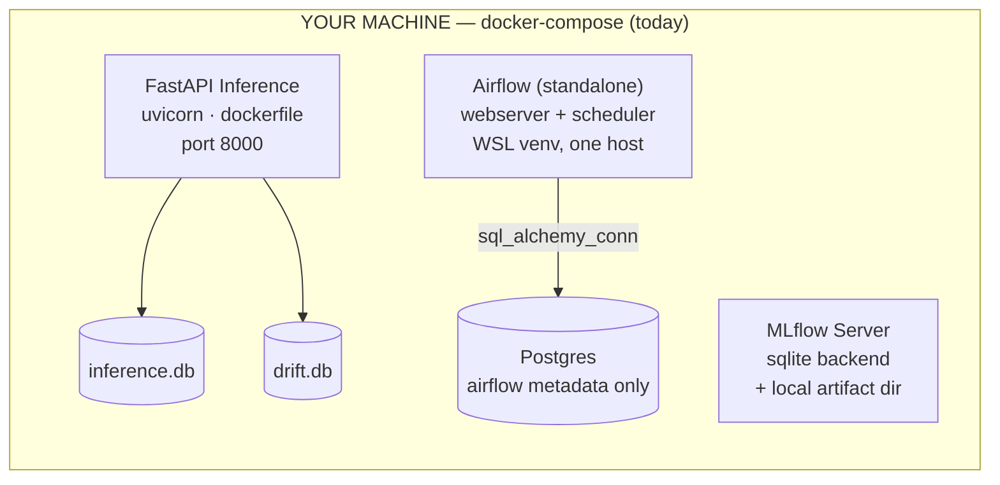
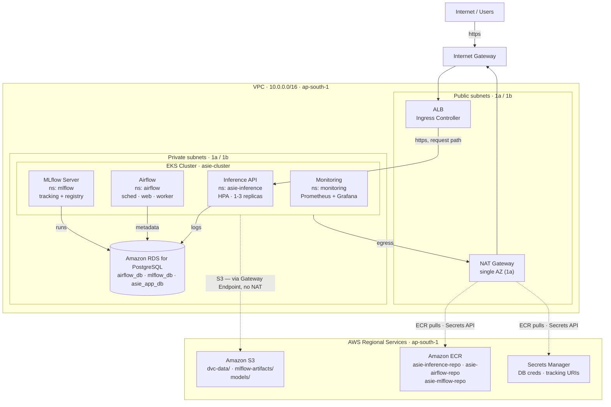

# ASIE — AWS Target Architecture

**Week 11 · Day 1 of 7 — AWS Architecture Planning**
Region: `ap-south-1` · Status: Active · 2026-08-10 · Last updated 2026-08-13 (Day 6 authored; Days 4-6 all pending deploy)

Moving ASIE off a single-host Docker Compose setup onto a fully AWS-hosted platform — inference serving, orchestration, and monitoring all running in-cluster, nothing left on a laptop.

## Contents

- [§1 Context](#1-context)
- [§2 Current State](#2-current-state)
- [§3 Target Architecture](#3-target-architecture)
- [§4 Service Mapping](#4-service-mapping)
- [§5 Migration Plan](#5-migration-plan)
- [§5b Lifecycle](#5b-lifecycle--asiesh-is-the-only-entry-and-exit-point)
- [§6 Networking Decisions](#6-networking-decisions)
- [§7 Open Items](#7-open-items)

---

## §1 Context

Weeks 1–10 built ASIE as a set of containers on one machine, coordinated by `docker-compose.yaml`: a FastAPI inference service, a standalone Airflow process for retraining, an MLflow tracking server, and a Postgres container that exists only to give Airflow somewhere to write metadata. Everything else — inference logs, drift scores, the model registry — lives in local SQLite files or a hand-edited YAML.

The brief for this migration is to run the whole system on AWS, **self-hosted** rather than farmed out to managed equivalents for Airflow and monitoring — reusing the EKS cluster and Helm tooling already being built for serving, instead of adding Amazon MWAA or Managed Prometheus/Grafana as separate billed services. Region is **ap-south-1**, chosen for cost and proximity.

---

## §2 Current State

What exists today, for reference against the target below.

Every service is a container (or, for Airflow, a bare process) on one machine. State lives in local SQLite files and a hand-edited `model_registry.yaml` — none of it survives a second replica, a redeploy, or a fresh clone. DVC has no configured remote and Terraform state is local-only, so even the infrastructure-as-code can't reproducibly rebuild this.

---

## §3 Target Architecture

Self-hosted end to end on one EKS cluster: inference, Airflow, MLflow, and the monitoring stack all run as workloads in the same cluster, backed by a shared RDS instance and one S3 bucket. Only the load balancer and NAT egress touch the public internet.

Four workloads share one EKS cluster instead of four separate services. The only line that changes behavior from today's system is the **S3 line bypassing NAT** via a gateway endpoint — free, and it keeps DVC/artifact/model traffic off the metered NAT path. Everything else (ECR pulls, Secrets Manager reads) rides the existing NAT → IGW route.

---

## §4 Service Mapping

What each piece of the local stack becomes, and why it has to change rather than just move.

| Local (docker-compose) | AWS Target | Why it can't just move as-is |
|---|---|---|
| `postgres` — Airflow metadata | RDS PostgreSQL · `airflow_db` | Managed instance survives pod restarts; the container version doesn't. |
| `mlflow` — SQLite backend | MLflow server (EKS) · RDS `mlflow_db` + S3 artifacts | SQLite can't be shared across replicas or survive a redeploy. |
| `airflow` — standalone process | Airflow Helm chart on EKS | Same reasoning, plus it becomes horizontally scalable and restart-safe. |
| FastAPI — `dockerfile` | Helm chart `asie-inference`, image from ECR | Already built (Weeks 3–4); it just needs a real registry behind it. |
| `inference.db` (SQLite) | RDS · `asie_app_db.inference_logs` | SQLite breaks the moment HPA runs more than one replica — each pod gets its own file. |
| `drift.db` (SQLite) | RDS · `asie_app_db.drift_metrics` | Same failure mode as above. |
| `model_registry.yaml` (file) | Same YAML, stored in S3 (`models/model_registry.yaml`) | *Day 4/5 revision:* stayed a YAML document rather than moving to the MLflow Model Registry. Only the retraining DAG writes it — a single writer, so the corruption risk that motivated the swap doesn't exist, and porting `model_registry.py`'s promote/rollback logic onto MLflow's registry API is a rewrite Day 4 didn't need. `load_registry`/`save_registry` read and write through S3 when `ASIE_MODEL_S3_URI` is set, local disk otherwise. |
| `exported_model/` (961 MB, baked into image) | S3 bucket, fetched at pod startup | Keeps the image thin. Delivered by an `amazon/aws-cli` initContainer syncing `models/` into an `emptyDir` the app container mounts. |
| `data/*.parquet` + DVC (no remote) | S3 bucket as DVC remote | `dvc pull` is currently impossible on a fresh clone or CI runner. |
| `prometheus.yml` / `alerts.yml` / `alertmanager.yml` | kube-prometheus-stack on EKS | `alerts.yml` ports to a PrometheusRule CR almost unchanged. |
| `.env` secrets | Secrets Manager → K8s Secret at deploy | No secret should live in a file that could get committed. |
| `asie-inference:latest` (local image) | ECR: `asie-inference-repo`, `asie-airflow-repo`, `asie-mlflow-repo` | A private registry, not a locally-tagged image nothing else can pull. Named `-repo` to match the `ECR_REPO` variable `asie.sh` already uses. The third repo was added Day 4: `ghcr.io/mlflow/mlflow` ships without `psycopg2`/`boto3`, so an RDS+S3-backed server needs a custom image rather than the upstream one. |

---

## §5 Migration Plan

Day 1 is this document. Days 2–7 follow the Task Board, with the concrete scope this architecture implies for each.

### Day 2 — Provision AWS Infrastructure ✅ Done (2026-08-11)

- ✅ Tagged both subnet tiers for EKS ownership (`kubernetes.io/cluster/asie-cluster=shared`)
- ✅ New `modules/rds`: instance + subnet group + security group — **with a sequencing deviation**: 5432 is scoped to the two private subnet CIDRs, not the EKS node security group specifically, because that SG doesn't exist until eksctl creates it on Day 3. Still fully private, just broader than the doc originally called for. Tracked in §7 to tighten once the real node SG exists.
- ✅ New S3 bucket (`asie-platform-<account-id>`, versioned, encrypted, public access blocked) + gateway endpoint. The three prefixes aren't provisioned objects — they appear when Day 5 actually writes to them.
- ✅ New ECR repositories — **named `asie-inference-repo` / `asie-airflow-repo`**, not `asie-inference` / `asie-airflow` as originally written here, to match the `ECR_REPO` variable `asie.sh` already uses instead of creating a second repo that script doesn't know about.
- ✅ Dropped `aws_key_pair.asie_auth` and the entire `modules/ec2` (bastion + 2× `t3.medium`) rather than relocating the key — went with the SSM Session Manager option. `eks-cluster.yaml` updated to drop `ssh:`. (Day 3 correction: there's no `iam.withAddonPolicies.ssm` field in eksctl's schema — `eksctl create cluster` rejected it with `unknown field "ssm"`. Managed node groups get `AmazonSSMManagedInstanceCore` attached by default now, so no explicit config is needed at all.)
- ⏸ S3 backend for Terraform state — deferred. State stays local for now; revisit if this becomes a team project.
- ✅ Applied to `ap-south-1` (2026-08-11) — infrastructure is live. Hit and fixed one bug along the way: the RDS security group's description contained an apostrophe, which AWS rejects. See the Day 2 addendum in Daily Updates for details.

### Day 3 — Deploy Kubernetes Platform ✅ Done (2026-08-12)

- ✅ Node sizing resolved: `t3.xlarge × 2` (not `t3.large` as originally noted here — `t3.medium`/`t3.large` both cap at 2 vCPU, only RAM differs between them; `t3.xlarge` is the first step that actually adds CPU headroom, 4 vCPU/16GiB per node). `eks-cluster.yaml` updated.
- ✅ `eksctl create cluster` with `iam.withOIDC: true` — cluster `asie-cluster` live, 2 nodes `Ready`, OIDC provider registered. New `eks/render-cluster-config.sh` fills the VPC/subnet placeholders from Terraform outputs (`asie.sh` now calls it instead of duplicating the `sed`). Hit one bug: `iam.withAddonPolicies.ssm` isn't a real eksctl field — removed entirely, since eksctl attaches `AmazonSSMManagedInstanceCore` to managed node groups by default now.
- ✅ Namespaces created: `asie-inference`, `airflow`, `mlflow`, `monitoring` (`eks/namespaces.yaml`)
- ✅ AWS Load Balancer Controller installed via Helm (`eks/aws-load-balancer-controller-values.yaml`), IRSA service account in `kube-system`, IAM policy pinned at `eks/iam-policies/aws-load-balancer-controller-policy.json`. 2/2 pods `Running`, no permission errors.
- ✅ RDS security group tightened to the EKS cluster SG (see §7).

### Days 4 + 5 — Deploy Services & Migrate Storage 🚧 In progress (2026-08-12/13)

**Run as one sequence, not two days.** Day 4's deploys can't be verified without Day 5's storage work landing first: the inference pod has nowhere durable to log until RDS has schema, MLflow won't boot until `mlflow_db` exists, and a 961 MB model baked into the image makes every deploy iteration painful. The dependency runs storage → services, so the days were merged rather than done in the order originally written here.

Landed and verified:

- ✅ **Image slimming.** `requirements_inference.txt` split into `requirements_serving.txt` (slim) and `requirements_airflow.txt` (full) — it was shared by both Dockerfiles, so slimming in place would have silently broken the Airflow image, which genuinely needs mlflow/dvc/datasets. CPU-only torch installed from `download.pytorch.org/whl/cpu`. Inference image: **2.05 GB, down from ~7-8 GB**.
- ✅ **Third ECR repo** (`asie-mlflow-repo`) provisioned via Terraform, mirroring the existing two.
- ✅ **Three least-privilege IAM policies + IRSA service accounts**, one per workload — closes the §7 open item. Each policy carries both an object-level statement *and* a `ListBucket` statement scoped by `Condition: StringLike: s3:prefix`; without the second, `aws s3 sync` fails with AccessDenied even when `GetObject` is allowed, since `ListBucket` is a bucket-level action that object ARNs can't restrict.
- ✅ **`exported_model/` → S3**, fetched at pod startup by an `amazon/aws-cli` initContainer. `export_model.py` and `model_registry.py` also became S3-aware so *retrained* models persist — otherwise every retrain would be lost on pod restart and deploying Airflow would accomplish nothing durable.
- ✅ **RDS bootstrapped** — `airflow_db`, `mlflow_db`, and three least-privilege roles created; both SQLite schemas ported to Postgres (`TEXT` timestamps → `TIMESTAMPTZ`, `AUTOINCREMENT` → `GENERATED ALWAYS AS IDENTITY`). Done via a one-shot in-cluster Job, not a bastion or tunnel — RDS is private-subnet-only and there's no network path from a dev machine, and a committed idempotent Job is the only approach that survives `asie.sh down`/`up`.
- ✅ **App code ported to SQLAlchemy** (`src/db/engine.py`) — one code path serves both local SQLite and cluster Postgres via `text()` with named binds, no dialect branching. Verified end-to-end locally.
- ✅ **Charts authored and validated** (`helm template` renders clean): `helm/asie-mlflow/` written from scratch, `eks/airflow-values.yaml` for the official chart at `LocalExecutor`.
- ✅ **`asie.sh` rewritten** — fixed the live namespace bug (`asie-inference-namespace` vs. the real `asie-inference`) and the undefined `$RELEASE_NAME`, and extended to a 13-step flow covering all three workloads.

**Deployed and verified 2026-08-14**, once IPv4 connectivity returned:

- ✅ All three images pushed to ECR; the whole stack deployed via `./asie.sh up`.
- ✅ End-to-end path confirmed: initContainer syncs 961 MB of models from S3 → `POST /predict` through the ALB → rows in RDS `inference_logs` (verified by direct `psql` query).
- ✅ `terraform apply` clean, S3 lifecycle rule live, orphaned multipart uploads cleared.

The first real run surfaced four failures that no amount of offline validation would have caught — every one of them left pods that *looked* healthy:

1. **Airflow migrations crash-looped.** `requirements_airflow.txt` pinned `SQLAlchemy==2.*`, added during the Postgres port where it was correct for the serving image and silently wrong for Airflow. Airflow 2.10's ORM still uses legacy non-`Mapped[]` annotations, so 2.x raises `MappedAnnotationError` on `TaskInstance.dag_model` and the migration job dies before creating a single table. Pinned `>=1.4.36,<2.0`; `src/db/engine.py` gained `future=True` so its 2.0-style API works on 1.4 as well (a no-op on 2.x, so one code path serves both images).
2. **Inference stuck in `Init:ImagePullBackOff`.** `amazon/aws-cli:2` is not a real tag on Docker Hub. Switched to `public.ecr.aws/aws-cli/aws-cli:latest`, which also avoids Docker Hub's anonymous pull limit.
3. **MLflow OOMKilled** at the 1 GiB limit before serving a request — MLflow 3.x runs background job infrastructure in-process (huey consumers, 5 threads per worker) that 2.x did not. One worker, 2 GiB.
4. **Airflow loaded zero DAGs.** `datasets` was dropped in the Day 4 requirements split; the DAG imports it via `src.models.factory`. Scheduler and webserver were both `Running` the entire time, which is exactly why this wasn't obvious.

Also hit a **StatefulSet deadlock**: a crash-looping scheduler pod blocks its own rolling update, so the fixed image never rolled out until the pod was deleted manually. Worth knowing — `asie.sh` cannot resolve that on its own.

**The blocker, diagnosed:** this host cannot sustain a large upload. 12 push attempts failed across all three images — including the smallest — and the decisive test was non-Docker: a plain `aws s3 cp` of a 200 MB file died at part 10 of its multipart upload. Small requests are unaffected throughout (`kubectl`, `aws s3 ls`, a 164 KB `dvc push`, `docker pull hello-world` all fine). The error is `WSAECONNABORTED` — "an established connection was aborted by the software in your host machine" — which Windows emits for a *local* abort, so the usual suspects are a VPN client, endpoint-security TLS inspection, or the router, not AWS. `max-concurrent-uploads: 1` and a Docker restart were tried and did not help, consistent with the problem sitting below Docker.

**When picked back up**, the options are (a) resolve the host-side network issue and re-push, or (b) build inside AWS — a Kaniko Job on the existing cluster, or CodeBuild — so only the ~9 MB git push leaves the machine and the 8.6 GB of layer traffic stays inside AWS. (b) is the more robust answer and doesn't depend on diagnosing the local network.

Bugs found and fixed along the way (details in Daily Updates): a `.dockerignore` pattern that was silently stripping `src/pipelines/` from every build; `check_drift` returning `None` on its success path, which made the retraining DAG skip retraining even when drift *was* detected; a bootstrap script that regenerated DB passwords on every run, desyncing them from the roles it had already created.

### Day 6 — Cloud Monitoring & Observability 🚧 Authored, not yet deployed (2026-08-13)

Written offline while the images remain unpushable, so the next connectivity window is spent running things rather than writing them. Everything testable without a network has been tested; nothing here has touched the cluster.

- ✅ **EBS CSI driver + gp3 StorageClass.** Found while planning: `eks-cluster.yaml` had no `addons:` block, and the in-tree EBS provisioner was removed in Kubernetes 1.23 — so every PVC, including Prometheus's and Grafana's, would have sat `Pending` forever with no obvious error. `asie.sh` also gained an idempotent `eksctl create addon` path, since the declaration in `eks-cluster.yaml` only applies at cluster-create time and this cluster already exists. gp3 over the built-in gp2 default (cheaper, and a fixed 3000 IOPS baseline instead of one that scales with volume size); gp2 is explicitly demoted, because two StorageClasses both claiming `is-default-class` makes binding non-deterministic. `volumeBindingMode: WaitForFirstConsumer` — EBS volumes are AZ-scoped and this cluster spans two AZs, so immediate binding can strand a pod in an AZ with no schedulable node.
- ✅ **Application instrumentation** (`src/serving/metrics.py`, new). The API exported exactly one business metric (`asie_data_drift_score`), so dashboards and alerts built on it alone would have been nearly empty. Added request count, latency histogram, in-flight gauge, and a model-loaded gauge via FastAPI middleware, using the `prometheus_client` dependency the image already carried — no new packages, so the slim serving image stays slim. Latency buckets are tuned for CPU transformer inference rather than left at the defaults.
  - The `route` label is the **route template**, never the raw path. Labelling by raw path would give every 404 from a scanner its own time series and would fan out one series per id the moment any path parameter is added — the standard way a metrics endpoint takes Prometheus down.
  - `/metrics` is excluded from its own instrumentation: at one scrape per 30s per replica it would dominate request-rate graphs on a low-traffic service.
  - `PROMETHEUS_TEXT_MEDIA_TYPE = "text/plain"` replaced with `prometheus_client.CONTENT_TYPE_LATEST` — the old value omitted `version=0.0.4; charset=utf-8`.
- ✅ **Drift staleness is now observable.** `get_latest_drift_metric()` returns the newest row regardless of age, so a dead drift worker looked *identical* to a healthy low-drift system and neither `DriftWarning` nor `DriftCritical` could ever fire. Added `get_latest_drift_record()` (score **and** timestamp, one query — the old function is now a thin wrapper) and an `asie_drift_last_updated_timestamp_seconds` gauge, with a `DriftMetricsStale` alert watching it.
- ✅ **ServiceMonitor** (`helm/asie-inference/templates/servicemonitor.yaml`). This required fixing two prerequisites: the Service's port was **unnamed** and the Service carried **no labels** — a ServiceMonitor selects Services by label and references ports by name, so it could not have targeted this Service as written. The template is gated behind `serviceMonitor.enabled` (default off) so the chart still installs on a cluster without the Prometheus Operator CRDs, where an ungated manifest would fail the whole release.
- ✅ **kube-prometheus-stack values** (`eks/monitoring-values.yaml`). Resource requests are set explicitly rather than left at chart defaults: 2× t3.xlarge is ~7.8 allocatable CPU and inference alone can request 4.5 once the HPA scales to 3. `serviceMonitorSelectorNilUsesHelmValues: false` is the setting that actually lets Prometheus discover ServiceMonitors in other namespaces — left at its default, the Targets page is simply empty with no error logged anywhere. Control-plane scrape jobs (`kubeEtcd`, `kubeControllerManager`, `kubeScheduler`, `kubeProxy`) are disabled: on EKS those endpoints are AWS-managed and unreachable, so they sit permanently down and fire constant `TargetDown` alerts, which is worse than no monitoring because it trains you to ignore the alert list.
- ✅ **PrometheusRule + Grafana dashboard** as version-controlled manifests (`eks/monitoring-rules.yaml`, `eks/grafana-dashboard-asie.yaml`). The two drift rules port over unchanged; added staleness, 5xx error-rate, p95 latency, and model-not-loaded rules now that the metrics exist. `prometheus/alerts.yml` and `alertmanager.yml` stay in the repo for the local standalone workflow the README documents — the deployed Alertmanager config repoints the webhook from `localhost:8000` to the in-cluster Service DNS.
- ✅ **Deployed and verified 2026-08-14.** 20/20 Prometheus targets up, the `asie-inference` ServiceMonitor scraping, all six ASIE alert rules loaded, Grafana serving on the shared ALB at `/grafana`, and one ALB with zero stray LoadBalancer Services.

Three monitoring bugs only became visible once it was actually running, and all three were mine:

1. **There was no Alertmanager at all.** Helm merges `route` as a map but *replaces* `receivers` as a list. The chart's default route carries a child `routes:` entry pointing at a receiver named `null` (it swallows the always-firing Watchdog/InfoInhibitor heartbeats); overriding `receivers` without redefining `null` deleted it while that child route survived the merge, so the operator refused to build the config secret — no StatefulSet, no pod, and **every alert silently went nowhere**. `helm template` cannot catch this: the chart renders valid YAML and the rejection happens in the operator at runtime. The only symptom was `PrometheusNotConnectedToAlertmanagers`, which was correct and easy to dismiss as noise.
2. **`DriftMetricsStale` fired immediately on a fresh deploy.** A Gauge that has never been `.set()` still exports as `0`, so with an empty `drift_metrics` table the rule evaluated `time() - 0` ≈ 1.8 billion seconds. Guarded with `> 0`.
3. **`TargetDown` fired permanently for Grafana.** `serve_from_sub_path` — added so Grafana works behind the shared ALB — moves *every* route under `/grafana`, including Grafana's own `/metrics`, which the chart's ServiceMonitor still scraped at `/metrics` (301). Verified directly: `/metrics` → 301, `/grafana/metrics` → 200.

Points 2 and 3 are the same failure this section's values file already disables the control-plane scrape jobs to avoid: **an always-firing alert is worse than no alert, because it teaches you to ignore the list.** Both were introduced while trying to prevent exactly that.

### Day 6 addendum — ingress consolidation, partially delivered

§6's "one ALB for all ingress" is met, but for **inference and Grafana only**. Both `Ingress` objects share an `alb.ingress.kubernetes.io/group.name`, which is what makes the AWS Load Balancer Controller merge them onto a single ALB rather than provisioning one each; two objects are needed because an Ingress can only reference Services in its own namespace. The inference Service also flipped from `LoadBalancer` to `ClusterIP` — left as-is it would have kept its own separate ELB alongside the ALB, and the consolidation would have saved nothing.

Airflow and MLflow are deliberately still on `kubectl port-forward`. Both need their own public base URL to generate working links (`webserver.base_url`, `--static-prefix`), and that URL is the ALB's DNS name, which doesn't exist until the Ingress is applied — so wiring them needs a two-pass deploy: apply, read the hostname, then `helm upgrade` both. That flow can't be tested until the images deploy, and shipping an unverifiable, fragile deploy step is worse than shipping a documented gap. Tracked below.

### Day 7 — End-to-End AWS Validation

- Full inference → drift → alert loop, exercised in-cluster
- Architecture screenshots, README/PDR updates, close out the Task Board

---

## §5b Lifecycle — `asie.sh` is the only entry and exit point

Four commands, composed from the same phase functions so they can't drift apart (a `resume` that runs a different sequence than `up` fails only in production).

| Command | Does | Keeps |
|---|---|---|
| `up` | Provision, build, push, deploy everything. Idempotent. | — |
| `pause` | Delete workloads + cluster. | S3, ECR, RDS, VPC — **no data lost** |
| `resume` | Rebuild cluster and redeploy on surviving data. Skips Terraform and the image build, since neither was torn down. | — |
| `down` | Destroy everything, including all data. **Irreversible.** | nothing |

Three problems this replaced, all found by tracing what `down` actually did rather than what it printed:

- **`down` could not complete.** The S3 bucket had no `force_destroy` and the ECR repos no `force_delete`, so `terraform destroy` hit `BucketNotEmpty` — but only *after* destroying RDS and the VPC, since neither depends on the bucket. The result was a half-destroyed stack, which is worse than either finishing or refusing. Both force flags are now set, and `down` is gated behind a typed `destroy asie` confirmation that lists what will be lost. It also refuses outright on a non-TTY, so a stray CI invocation can't wipe the account.
- **Cost control required the nuclear option.** There was no way to stop paying for compute without also destroying the S3 models — which, on a connection that can't sustain a large upload, is unrecoverable. `pause`/`resume` exist for exactly that, and cost roughly $10.60/day of the ~$12 total.
- **`pause` would have broken authentication.** `00_create_databases.sql` created each role *with* its password and skipped roles that already existed. But the roles live in RDS and the passwords live in a Kubernetes Secret — different lifetimes. A pause deletes the Secret while RDS survives, so the next run generates fresh passwords, finds the roles present, skips `CREATE`, and never applies them. Every workload then fails to authenticate with nothing in the logs explaining why. Each role is now `CREATE`d if absent and `ALTER`ed unconditionally, so the password re-syncs on every run.

`down` also cleans up the IAM policies and the EBS CSI role created outside Terraform (via `aws iam create-policy` and `eksctl --role-only`); previously those survived teardown and collided with the next `up`.

---

## §6 Networking Decisions

Concrete calls, each with the reasoning behind it.

**Reuse the existing VPC.** `modules/network` (10.0.0.0/16, 2 AZs) is already EKS-tagged for ELB roles — only the cluster-ownership tag is missing.

**Single NAT Gateway.** One AZ's worth of egress is an acceptable single point of failure for a budget-conscious project — it stalls egress, it doesn't lose data.

**Add an S3 Gateway Endpoint.** Free, and it removes DVC/MLflow/model traffic from the metered NAT path entirely — the one line in §3 that isn't a straight lift of today's topology.

**One ALB for all ingress.** Path/host routing to the inference API, Grafana, and the Airflow webserver. Four separate LoadBalancer Services would mean four billed ELBs.

**RDS: private only, one SG rule.** Inbound 5432 from the EKS node security group exclusively. No public endpoint, no exceptions. *(As provisioned Day 2: scoped to the private subnet CIDRs instead, since the node SG doesn't exist until Day 3's `eksctl create cluster` — see §7.)*

**Drop the bastion + SSH key pair.** `asie-key-pair.pem.pub` isn't in the repo and breaks Terraform on a fresh clone. SSM Session Manager replaces it — no key material to manage or leak.

**Tag subnets for EKS ownership.** `kubernetes.io/cluster/asie-cluster=shared` on both tiers — required for the node group and load balancer controller to function.

**Defer Multi-AZ RDS.** Single-AZ to start. Promoting to Multi-AZ later is a no-downtime modification, not an architecture change.

---

## §7 Open Items

Flagged now, decided later — none of these block starting Day 2.

- ~~**Tighten the RDS security group.**~~ Resolved Day 3 — ingress now references the EKS cluster security group (`sg-0a4fc01ec840df1ed`) directly instead of the private subnet CIDRs. Note: the SG's `description` field is immutable in the AWS provider (changing it forces a full destroy/recreate) and AWS refuses to delete a SG still attached to the RDS instance's ENI — so the description was left as-is and only the `ingress` block's `cidr_blocks` → `security_groups` swap was applied in place, via a new `data "aws_eks_cluster"` lookup in `modules/rds/main.tf`.
- ~~**Node capacity.**~~ Resolved Day 3 — `t3.xlarge × 2`, see §5.
- ~~**IRSA role granularity.**~~ Resolved Day 4 — one role per workload as planned, policies pinned at `eks/iam-policies/asie-{inference,airflow,mlflow}-policy.json`. Scopes landed narrower than "each workload gets the bucket": inference gets read-only on `models/*` and nothing else; mlflow gets read/write on `mlflow-artifacts/*` and nothing else; airflow, the only workload that actually writes across prefixes, gets `models/*` + `mlflow-artifacts/*` read/write and `dvc-data/*` read/write. Notably `dvc-data/*` is **not** in inference's policy — tracing the serving import graph confirmed nothing on the request path reads DVC data (drift reference windows come from `inference_logs`, not files). No ECR actions in any of them: the kubelet pulls images using the *node* role, not the pod's IRSA role, so granting ECR here would be pure noise.
- **Secrets delivery.** Starting with plain K8s Secrets populated at deploy time, matching `asie.sh`'s existing style. External Secrets Operator (auto-sync, rotation) is a reasonable later upgrade, not a Day 1 blocker. *(Day 4 note: the §3 diagram still shows Secrets Manager as the source; in practice nothing reads it yet — DB credentials flow `terraform output` → K8s Secret. The diagram describes the intended end state, not what's wired today.)*
- ~~**Airflow DAG delivery.**~~ Resolved Day 4 — DAGs are **baked into the image**, not git-synced. Git-sync would need in-cluster git credentials for no real gain, since `src/` has to be in the image regardless (the DAG imports the retraining pipeline directly), so a sidecar would leave DAG code and the library it calls on two different update paths. `dags.gitSync.enabled: false`, `dags.persistence.enabled: false`.
- **Ingress consolidation — partially resolved Day 6.** Inference and Grafana now share one ALB via `group.name`, and inference's Service dropped from `LoadBalancer` to `ClusterIP` so it stops provisioning a second ELB. **Still open:** Airflow and MLflow, which need the ALB's DNS name baked into their own config to generate working links — a two-pass deploy (apply Ingress → read hostname → `helm upgrade`) that can't be verified until the images are in ECR. They remain on `kubectl port-forward`. Revisit on Day 7 alongside end-to-end validation, when the two-pass can actually be exercised.
- **MLflow artifact proxying is deliberately off.** The server runs with `--no-serve-artifacts`. Since MLflow 2.0 the default is to proxy artifact traffic through the tracking server, which would funnel every model upload through a single pod and make the IAM design wrong — the policies grant *airflow* write access to `mlflow-artifacts/*` on the assumption clients talk to S3 directly.

---

*ASIE — Automated Sentiment Intelligence Engine · Week 11 · Day 1 — AWS Architecture Planning*
