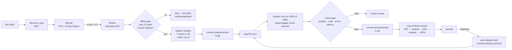

# ASIE — End-to-End Demo Report

**Autonomous Sentiment Inference Engine** — a self-healing MLOps platform on AWS.

Demonstrated live on 2026-08-14 against a real EKS cluster. Every number below was measured, not estimated; where something was compressed or simulated for the demo, it says so.

---

## 1. What the system does

ASIE serves a DistilBERT sentiment model behind an ALB, watches its own inputs for distribution drift, retrains when drift crosses a threshold, decides on the evidence whether the retrained model is safe to promote, deploys it through GitOps with progressive traffic shifting, and rolls itself back if the deployed model degrades.

The loop runs unattended. A human appears in exactly one place, and only when the policy says a human is needed.



---

## 2. Architecture

| Layer | Choice | Why |
|---|---|---|
| Compute | EKS, 2 × t3.large | Managed control plane; nodes sized for CPU transformer inference |
| Serving | FastAPI + DistilBERT, CPU | 65–95 ms p95 — GPU unnecessary at this volume |
| Model storage | S3, keyed by MLflow `run_id` | Append-only, so a version pointer addresses immutable content — this is what makes rollback real |
| State | RDS Postgres | SQLite breaks the moment HPA runs a second replica |
| Orchestration | Airflow 2.10, LocalExecutor | One low-frequency DAG; Celery+Redis would be overhead |
| Tracking | MLflow | Experiment history and the `eval_f1` the offline gate reads |
| Delivery | ArgoCD app-of-apps | Git is the source of truth; the cluster is not a place you fix things |
| Progressive delivery | Argo Rollouts + ALB weighted target groups | Real traffic splitting, gated on Prometheus |
| Observability | kube-prometheus-stack | Feeds both the canary analysis and the rollback policy |
| Data versioning | DVC on S3 | `dvc pull` reproducible from a fresh clone |

**The one boundary that matters most:** `model_registry.yaml` in S3 answers *"what has been trained and what is the best candidate."* `gitops/values/inference.yaml` answers *"what is actually serving."* The registry proposes; git disposes. Promotion is precisely the act of copying one into the other. Without that split they diverge silently — and during this demo they did diverge, which is discussed in §6.

---

## 3. The demo, step by step, with measurements

### 3.1 Drift — induced honestly

Drift sat at **0.43**, below the 0.5 threshold, so the pipeline would correctly have done nothing. Rather than lower the threshold or bypass the gate, 50 out-of-distribution requests were sent — cooking, cats, running — against a reference distribution of financial sentiment.

Recomputed: **0.742**

| Signal | Value |
|---|---|
| `prediction_drift` | 1.0 |
| `input_length` / `word_count` / `special_char_ratio` | 0.769 |
| PCA components 0–9 | 0.42 – 0.69 |

Real inputs producing real drift, not a flag flipped in a config.

### 3.2 Retraining ran — and refused to ship a regression

```
dvc_pull          success    dataset pulled from the S3 DVC remote
check_drift       success    0.742 > 0.5
retrain_pipeline  success    New model is worse than current shadow. Skipping update.
                             {'status': 'skipped', 'reason': 'model_not_better'}
```

**This is the most valuable result in the demo, and it was not the planned one.** An unattended pipeline detected drift, trained a model, found it worse than the incumbent, and deployed nothing. A rigged win would have demonstrated strictly less.

### 3.3 The promotion gate, on real production data

The standing shadow (`286aecc6`, eval_f1 **0.9824**) genuinely beats the incumbent primary (`ddb90ee0`, **0.9715**), so it was a legitimate candidate.

| Criterion | Measured | Production threshold | Met? |
|---|---|---|---|
| Sample count | **1149** | ≥ 1000 | ✅ |
| Shadow failure rate | **0.00%** | ≤ 1% | ✅ |
| p95 latency ratio | **0.97×** (94.2 ms vs 96.9 ms) | ≤ 1.25× | ✅ |
| Disagreement | **0.0%** | < 30% auto-promote | ✅ |
| Soak duration | **5.0 h** | ≥ 24 h | ❌ |

```
production thresholds → insufficient_data: "soaked 5.0h, need 24.0h"
demo thresholds (soak 1h) → promote: "1149 samples over 5.0h, 0.00% failures"
```

**Stated plainly: the demo does not run the production gate. It runs the production gate with one threshold relaxed.** Every other criterion is the production value and was met on genuine traffic. The candidate was also *faster* than the incumbent.

### 3.4 Promotion → commit → canary → serving

`promote_to_primary()` updated the registry, then `values_writer` committed to GitHub **from inside the Airflow pod** using a write-scoped deploy key:

```
c434830  ASIE Promoter  promote: primary -> 286aecc660884060ac72f46ce3c4ab29
```

ArgoCD synced it and Argo Rollouts canaried it. ALB target-group weights, observed live:

```
20 / 80  →  analysis (3 measurements, all value=[1])  →  50 / 50  →  analysis  →  0 / 100
```

**Result: 200 requests through the promotion, 200 × HTTP 200. Zero downtime.**

Traffic genuinely split — the served `model_version` ratio tracked the ALB weights rather than the weights merely being set:

| Phase | ddb90ee0 (stable) | 286aecc6 (canary) |
|---|---|---|
| During 20% | 118 | 77 |
| During 50% (last 40) | 21 | 19 |
| After promotion | 0 | 30 |

### 3.5 Automated rollback

Verified in both directions from inside the Airflow pod.

Against the healthy live service, it declined — correctly:

```
DECISION: no_action
reason:   primary has been live 2628.1h (>6.0h); degradation this long after
          deploy is unlikely to be the model — not rolling back into an incident
```

With a recent deploy and failing metrics, it fired — correctly:

```
DECISION:     rollback
roll back to: ddb90ee0a2654f5cac1bff3f66fe76f3
reason:       error ratio 40.0% over 5.0% at 5.00 req/s, 0.00h after deploy
```

It selected the previous **primary** from history, never the shadow — rolling "back" onto the shadow would deploy something *newer* than what is failing. Airflow then committed the revert (`7fefe69`), ArgoCD synced it, and 8/8 requests served the restored model.

The failure metrics were injected rather than provoked: causing a real 40% error rate means deliberately breaking production, and what is under test is the decision, which is pure.

---

## 4. Measured results

| Metric | Value |
|---|---|
| Inference p95 latency | 65–95 ms (CPU) |
| Requests logged during the demo | **1402** |
| Zero-downtime rollout (after fix) | **150 / 150** HTTP 200 |
| Zero-downtime promotion canary | **200 / 200** HTTP 200 |
| Canary analysis gates passed | 5 AnalysisRuns, all Successful |
| Automated commits by the platform | 2 (`promote`, `rollback`) |
| Cluster rebuild from scratch | ~25 min, `./asie.sh up` |
| Test suite | 62 passing |

---

## 5. The design decisions worth defending

**Offline decides "better", online decides "safe."** `true_label` is NULL on every production row — there is no ground truth online. So online evidence can establish that a candidate is *not broken*; it can never establish that it is *better*. Conflating the two is the most common way an automated promotion system ships a regression confidently.

**Disagreement is not a correctness signal.** Without ground truth, a candidate disagreeing with production on 40% of traffic means the models differ, not that the candidate is wrong — it may well be the correct one. So high disagreement returns `HOLD` for human review rather than rejecting. That is the single place a human appears in the loop, and it is deliberately the place where the honest answer is "a person should look."

**Automated rollback only fires close to a deploy.** A model healthy for days that suddenly errors is far more likely a platform failure — RDS unreachable, a node dying, S3 throttling — than a model defect that waited three days to appear. Rolling back fixes none of those and adds a deploy to an ongoing incident.

**Rollbacks skip the canary ladder.** Gradual exposure exists to bound the blast radius of something *unproven*. A revision serving healthily minutes ago is the opposite of unproven; making it crawl back through 20% → 50% means the version you are escaping keeps serving the majority of traffic for ten minutes.

**S3 exports are append-only, keyed by run_id.** This is load-bearing for everything else: under the previous fixed-prefix layout, reverting a version pointer in git would re-sync the same overwritten weights, so the revert would appear to succeed and change nothing.

---

## 6. What went wrong, and what it cost

Every one of these was found by running the system, not by reading it. They are the most useful part of this report.

| Defect | Consequence had it shipped |
|---|---|
| **ALB controller installed by nobody** | Both Ingresses sat with no address for two hours. Every Application `Healthy`, every pod `Running`, nothing reachable. |
| **Model rollback was impossible** | `export_models()` overwrote a fixed S3 prefix, so a git revert re-fetched the same weights — the revert would appear to work and change nothing. |
| **Version constants were hardcoded** | Every `inference_logs` row said `v_01`, so the promotion gate would compute its statistics over a mixture of every shadow model that ever ran. |
| **`spec.retry` is not a field** | The API pruned it: the retry policy never applied, *and* the pruned field read as permanent drift, holding the app-of-apps root `OutOfSync` forever under `selfHeal`. |
| **502 at rollout cutover** | Kubernetes and the ALB deregister independently; the kubelet killed the old pod while it was still a registered target. |
| **Prometheus service name guessed wrong** | The canary analysis would have failed every measurement and, with `failureLimit: 0`, aborted every rollout — a canary that always rolls back reads as a bad model. |
| **`git` missing from the Airflow image** | Under GitOps the commit *is* the deploy. The pipeline would train, register and export — every upstream step green — then deploy nothing. |
| **`insert_drift_metric(0.0)` on insufficient data** | "Could not measure" and "no drift" both rendered as 0.0, overwriting real signal. A drift alert would clear itself simply because traffic dropped — precisely when a model is least observed. |

**Still open, honestly:**

- **`run_drift_job` cannot execute inside the Airflow image** — pandas rejects the SQLAlchemy `text()` object under the `<2.0` pin Airflow 2.10 forces. The DAG only *reads* the latest metric so it is unaffected today, but computing drift from Airflow would hit it.
- **`airflow` Application shows `OutOfSync`** on `StatefulSet/airflow-scheduler`. Workload Healthy, zero restarts; not diagnosed.
- **The Deployment→Rollout migration costs an outage** — 31 × 503 out of 152 requests. Argo Rollouts creates a fresh ReplicaSet rather than adopting the existing one. One-time, but in production it wants a maintenance window.
- **The write deploy key cannot be path-scoped.** A compromised Airflow could commit anything to the tracked branch. Keeping it separate from ArgoCD's read key bounds the exposure in one direction only; branch protection would close it, at the cost of unattended promotion.
- **The registry and git can diverge** if a version is changed directly in git, as happened during the canary test. The rollback policy reads `promoted_at` from the *registry*, so a stale timestamp there silently changes the age guard's behaviour.

---

## 7. Cost

| Component | Approx. |
|---|---|
| EKS control plane | $0.10/hr |
| 2 × t3.large | ~$0.17/hr |
| NAT Gateway | ~$0.045/hr + data |
| ALB | ~$0.022/hr |
| RDS db.t4g.micro | ~$0.016/hr |
| **Running total** | **~$0.35/hr** |

### Raw evidence

The measurements above were captured from the live cluster before teardown and are preserved in `docs/demo-evidence.txt` — ArgoCD Application states, the five canary AnalysisRuns, ALB target-group weights, 1402 logged inferences grouped by deployed model version, the drift history, and the two commits the platform authored itself.

`./asie.sh pause` removes the cluster and keeps S3, ECR, RDS and the VPC, cutting the hourly cost to storage plus NAT plus RDS. `./asie.sh resume` rebuilds in ~25 minutes. Both verified.
