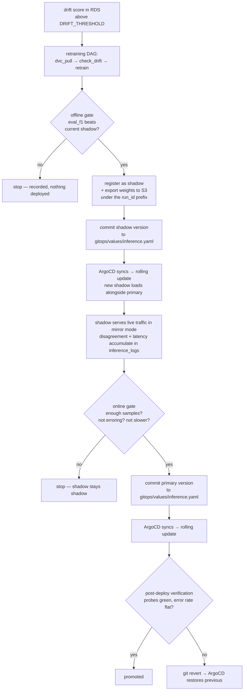

# Deployment Architecture

Week 12 (GitOps Deployment), Day 1. Covers the four Day-1 deliverables: GitOps architecture, deployment workflow, promotion policy, rollback strategy.

Companion to `GITOPS_AND_OPTIMIZATION_PLAN.md` (why this week comes first, and what the week contains) and `AWS_ARCHITECTURE.md` (the platform underneath).

---

## 1. The honest baseline

What exists today, before any of this week's work:

- `airflow-home/dags/retraining_dag.py` runs `dvc_pull >> check_drift >> retrain_pipeline`, daily. It **ends** at `retraining_pipeline()`.
- `retraining_pipeline()` runs experiments, selects the best, calls `register_shadow_model()`, then `export_models()`.
- `register_shadow_model()` has a real gate: the candidate is only registered if `eval_f1` beats the current shadow's.
- `export_models()` writes `exported_model/` and syncs it to `s3://…/models/`.
- `promote_to_primary()` exists in `src/models/model_registry.py` — **and is never called by anything.** It also has no gate: it copies shadow to primary unconditionally.
- Serving loads primary *and* shadow (`ModelLoader`), and `/predict` runs both, writing `disagreement`, `abs_diff`, and per-sample latency for each to `inference_logs` in RDS.

So the loop is broken in two distinct places, not one. The known gap is that nothing propagates a new model to running pods. The less obvious gap is that **nothing decides a model should be promoted at all** — `promote_to_primary()` is dead code with no policy attached.

The valuable thing already in place: shadow inference runs against 100% of live production traffic and records its disagreement with primary on every request. That is a stronger evaluation signal than a conventional canary, because it carries full traffic at zero blast radius — the shadow's outputs are logged, never returned. The promotion policy below is built on this rather than on anything new.

---

## 2. Source-of-truth boundary

Introducing git as the deployment source of truth creates an immediate ambiguity: `model_registry.yaml` (in S3) *also* claims to know which model is primary. Two records of the same fact will diverge, and the failure will be silent.

The boundary:

| | `model_registry.yaml` (S3) | `gitops/values/inference.yaml` (git) |
|---|---|---|
| Answers | "what has been trained, and what is the best candidate" | "what is actually serving production" |
| Written by | the training pipeline | the promotion step |
| Read by | training, experiment selection | ArgoCD |
| Nature | a *proposal* | a *decision* |

**The registry proposes; git disposes.** Information flows one way — promotion is precisely the act of copying a registry decision into git. The registry never reads git, and ArgoCD never reads the registry. Anything that wants to know what is serving reads git; anything that wants to know what exists reads the registry.

This also means `promote_to_primary()` stops being the promotion mechanism and becomes only the registry-side bookkeeping half of it.

---

## 3. Deployment workflow

Two separate deployments, not one. A retrained model is deployed *as a shadow* first, gathers live evidence, and only then is promoted. Both transitions are commits, so both are revertable and both are auditable in `git log`.

**Who writes the commit.** A new terminal task in the retraining DAG, after `retrain_pipeline`. The Airflow pod needs push access to the repo — a GitHub deploy key with write scope, stored in Secrets Manager and mounted via External Secrets. This is the one place the pipeline reaches outside the cluster to change desired state, and it should be the only one.

Rejected: ArgoCD Image Updater (solves image tags, not model versions — the model is data in S3, not a container tag); a controller watching S3 (invents a second reconciliation loop next to ArgoCD's, and hides the decision from `git log`).

---

## 4. Promotion policy

**The constraint that shapes everything:** `true_label` is `NULL` for every production row in `inference_logs`. There is no ground truth online. Therefore online evidence can establish that a model is **safe**, never that it is **better**.

So the policy splits cleanly:

- **Offline decides "better."** The held-out `eval_f1` from MLflow, gated in `register_shadow_model()`. This already exists and needs no change.
- **Online decides "safe."** Evaluated over the shadow's live window, from `inference_logs`.

### Online gate

All four must hold before promotion:

| Criterion | Threshold | Why this and not something else |
|---|---|---|
| Sample count | ≥ 1000 shadow predictions | Below this the rates below are noise. A model promoted on 20 requests was promoted on nothing. |
| Shadow failure rate | ≤ 1% rows with `shadow_predictions IS NULL` | `/predict` catches shadow exceptions and writes `None` rather than failing the request. That column is therefore already an error counter — a model that throws on 30% of real inputs looks fine offline and is caught only here. |
| Latency | p95 `shadow_latency_ms` ≤ 1.25 × p95 `primary_latency_ms` | A more accurate but materially slower model still breaks the serving SLO. The HPA would mask it by scaling out, turning a regression into a cost increase instead of an alert. |
| Disagreement | `disagreement` rate ≤ 30% → auto-promote; above → hold for manual review | **Not a correctness signal.** With no ground truth, high disagreement means the two models differ, not that the new one is wrong. It is a *surprise* detector: a candidate that disagrees with production on a third of traffic may be a genuine improvement, but should not promote itself unattended. |

Automatic when all four pass. The disagreement band is the only human gate, and it is deliberately the one place where the honest answer is "a person should look."

### What this does not cover

Promotion is currently all-or-nothing at the moment of the commit — every pod moves to the new primary in one rolling update. Serving the new model to a *fraction of users* is traffic splitting, which is Day 5's canary work and needs a different mechanism (Argo Rollouts). Shadow mode is not a canary and does not substitute for one; it derisks correctness, not blast radius.

---

## 5. Rollback strategy

Four layers, cheapest first.

**Layer 0 — the rollout that never completes (already in place).** `startupProbe` (30 × 10s) followed by `readinessProbe` on `/health`, which reports `primary_ready`. A model that fails to load never becomes ready, so the Deployment's rolling update stalls with the old pods still serving. Most catastrophic model failures are contained here, before any traffic reaches the new version, and this required no new work — it falls out of the existing chart.

**Layer 1 — `git revert` (the actual rollback).** Revert the promotion commit; ArgoCD detects drift and restores the previous version.

> **This, and specifically not `argocd app rollback`.** Every Application in `gitops/apps/` sets `selfHeal: true`. An ArgoCD-side rollback changes the cluster while git still specifies the new version, so ArgoCD reverts your rollback within minutes. Under GitOps the cluster is not a place you can fix things. Git is the only lever, and a rollback is a commit like any other.

**Layer 2 — automated revert (Day 6).** Alertmanager already posts to `/webhook` and `/drift-webhook` in `src/serving/app.py`; those handlers currently just print. They become the trigger: a sustained error-rate or latency alert on the newly promoted version fires a revert commit. Argo Rollouts' analysis templates are the more standard mechanism and are worth preferring if Day 5's canary work brings Rollouts in anyway — one mechanism is better than two.

**Layer 3 — image rollback.** Independent of model rollback: `image.tag` and `model.version` are separate lines in `gitops/values/inference.yaml`, revertable separately. A bad application deploy and a bad model deploy are different failures and should not share a rollback.

---

## 6. Two defects this design surfaced

Both block the rollback strategy above. Neither is visible until you try to write down what "roll back" means.

### 6.1 Model rollback is currently impossible, and the version annotation does not fix it

`export_models()` uploads to a **fixed** prefix: `s3://…/models/primary/model`, `…/shadow/model`. Every export overwrites the previous one in place. The initContainer syncs `s3://…/models/` wholesale into the pod.

So reverting `model.version` in git would restart the pods, they would re-sync the same prefix, and get **the same weights back** — the ones that were just overwritten. The git revert would appear to succeed and change nothing. The previous model's bytes no longer exist anywhere.

**Fix:** make the S3 layout versioned — `models/<run_id>/{model,tokenizer}/` — and have the initContainer sync only the prefix named by the pod's `model.version`. Exports become append-only, and `model.version` becomes a real content pointer rather than a label. This is a prerequisite for Day 6, not a nice-to-have, and it changes `export_model.py`, the chart's initContainer command, and the S3 lifecycle rule (old versions need an expiry, or the bucket grows without bound at ~961 MB per retrain).

### 6.2 The version recorded in `inference_logs` is a hardcoded constant

`src/constants/__init__.py` defines `PRIMARY_MODEL_VERSION = "v_01"`, `SHADOW_MODEL_VERSION = "v_02"`, `SERVED_MODEL_VERSION = "v0"`, and `/predict` writes those literals into every row.

The online promotion gate in §4 queries `inference_logs` to evaluate *a specific shadow model*. With a constant in that column, rows from every shadow model that ever ran are indistinguishable, and the gate would compute its metrics over a mixture of models. The policy cannot be implemented as designed until these come from the pod's environment — the same values written into `gitops/values/inference.yaml`, passed through the chart's ConfigMap.

This also means every drift and disagreement row recorded to date carries a version label that means nothing.

---

## 7. What this implies for the rest of the week

| Day | Task | Changed by this design |
|---|---|---|
| 2 | Automated Model Promotion | Implements §4. Blocked on 6.2. Needs the promotion gate as a queryable function over `inference_logs`, plus the DAG task that commits. |
| 3 | GitOps with ArgoCD | Scaffold is written (`gitops/`); this is installing it, wiring the repo deploy key, and first sync. |
| 4 | Rolling Deployments | Largely already satisfied by Layer 0 — verify rather than build. Spend the time on 6.1, which is the real blocker. |
| 5 | Canary Deployment | Needs Argo Rollouts. Note that shadow mode already covers correctness; canary covers blast radius. |
| 6 | Automated Rollback | Layer 2. Depends on 6.1 being done, or the rollback is a no-op. |
| 7 | Autonomous Pipeline Demo | The §3 workflow, end to end, unattended. |

**Recommendation:** fix 6.1 and 6.2 on Day 2, before the promotion work rather than after. Both are small changes to existing files, and every later day quietly assumes them.

---

## 8. Open questions

- **Shadow soak time.** The gate specifies ≥1000 samples but no minimum duration. At low traffic, 1000 samples might span an hour of one workload pattern. A minimum wall-clock window (24h?) would be more honest, at the cost of a slower demo.
- **Concurrent retrains.** The DAG is `@daily`. If a promotion is still soaking when the next retrain registers a new shadow, the second overwrites the first and the online evidence gathered so far is orphaned. Needs either a lock or an explicit "shadow is soaking, skip" branch.
- **Bucket growth** under versioned exports (6.1) — expiry policy needs a number.
