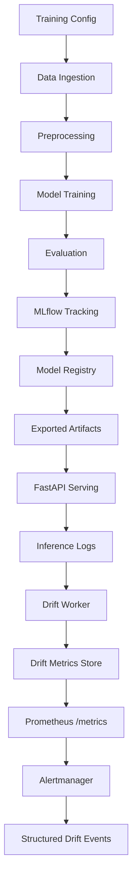
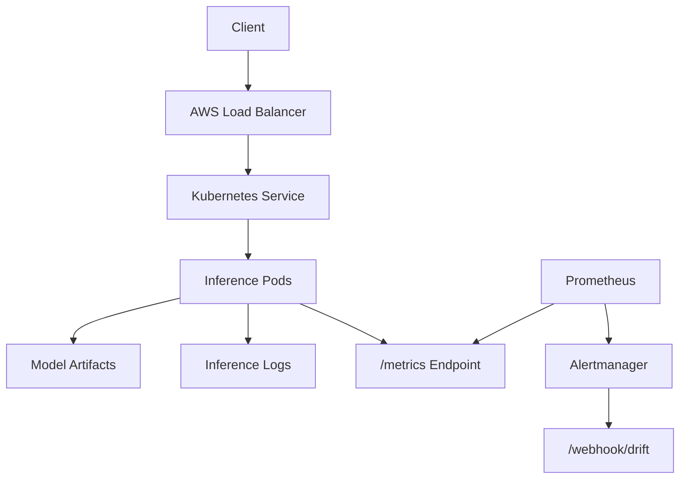
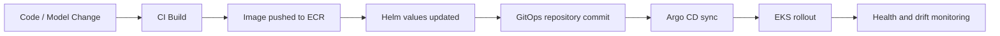
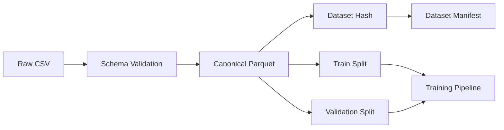

# Project Design Report: Automated Sentiment Intelligence Engine

## 1. Executive Summary

The Automated Sentiment Intelligence Engine (ASIE) is an end-to-end MLOps system for financial sentiment classification. The project is designed to move a natural language processing model beyond notebook experimentation into a reproducible, observable, and deployable machine learning service.

ASIE trains a transformer-based sentiment classifier, tracks experiments with MLflow, promotes selected model runs into serving artifacts, exposes inference through a FastAPI service, logs prediction metadata, computes drift signals, and exposes monitoring data through Prometheus-compatible endpoints. The system also includes infrastructure foundations for Docker, Kubernetes, Helm, Terraform, and EKS.

The system is **complete and was verified end to end on live AWS infrastructure on 2026-08-14**. It runs on EKS with RDS Postgres, models versioned in S3, and ArgoCD reconciling every workload from git — deploying a model is a commit and rolling back is a revert. Argo Rollouts shifts real traffic through a canary gated on Prometheus, a promotion policy decides on measured evidence whether a candidate is safe to serve, and a scheduled job reverts a degraded model automatically.

GPU-backed training was considered and deliberately dropped: at 65–95 ms p95 on CPU it would have cost roughly ten times more for latency nobody was waiting on. The infrastructure has since been destroyed to zero residual cost; `./asie.sh up` rebuilds it from an empty account.

The one structural limitation is stated plainly throughout this document: `true_label` is NULL on every production row, so no online signal can establish that a model is *better* — only that it has not broken.

## 2. Project Metadata

| Field | Value |
| --- | --- |
| Project Name | Automated Sentiment Intelligence Engine |
| Short Name | ASIE |
| Domain | Machine Learning Operations, NLP, Financial Sentiment Analysis |
| Primary Model Family | DistilBERT sequence classification |
| Primary Dataset | Financial PhraseBank, canonicalized as Parquet |
| Serving Framework | FastAPI |
| Training Stack | PyTorch, Hugging Face Transformers, Datasets, scikit-learn |
| Experiment Tracking | MLflow |
| Monitoring | kube-prometheus-stack (Prometheus, Alertmanager, Grafana) in-cluster |
| Deployment Target | AWS EKS via ArgoCD (GitOps) with Argo Rollouts canary delivery |
| Current Maturity | **Complete.** Autonomous loop verified end to end on a live EKS cluster, 2026-08-14. AWS subsequently torn down to zero. |

## 3. Problem Statement

Machine learning models used for sentiment analysis degrade over time when input data changes. Financial language is especially sensitive to shifts in market vocabulary, news cycles, company events, regulatory terms, and macroeconomic sentiment. A model that performs well during offline evaluation can become unreliable if deployed without reproducibility, monitoring, model versioning, or a controlled promotion path.

Traditional notebook-driven ML workflows usually fail to answer production questions such as:

- Which dataset version produced the current model?
- Which configuration and random seed were used?
- What metrics justified promotion?
- Which model version served a specific prediction?
- Has the production input distribution changed?
- Can a new model be evaluated safely before replacing the primary model?
- Can infrastructure be created and destroyed without leaving idle cloud resources?

ASIE addresses these concerns by treating the ML model as part of a software system with explicit lifecycle control.

## 4. Project Objectives

The main objectives of ASIE are:

1. Build a reproducible sentiment classification pipeline for financial text.
2. Track datasets, model parameters, metrics, runtime environment information, and Git metadata.
3. Promote selected model runs into immutable serving artifacts.
4. Serve predictions through a stable HTTP API.
5. Log online inference metadata for auditability and downstream monitoring.
6. Run a shadow model beside the primary model to compare behavior without affecting client responses.
7. Detect drift using multiple proxy signals when ground truth labels are not immediately available.
8. Expose drift metrics to Prometheus and route alerts through Alertmanager.
9. Prepare the system for AWS migration with cost-aware infrastructure practices.
10. Establish a roadmap for GitOps deployment and GPU-enabled training.

## 5. Scope

### 5.1 In Scope

- Financial sentiment classification using transformer-based NLP.
- Deterministic training and data preprocessing.
- Configuration-driven training parameters.
- Dataset manifesting and DVC pointer support.
- MLflow experiment tracking.
- Model registry metadata for primary and shadow models.
- FastAPI inference service.
- Primary and shadow model loading.
- SQLite-backed inference logging.
- Drift feature extraction from logged inference data.
- Drift scoring using feature drift and prediction distribution drift.
- Confidence shift and shadow disagreement analysis.
- Prometheus metric exposure.
- Alertmanager webhook ingestion and event transformation.
- Docker and Helm packaging.
- Terraform and EKS scaffolding for AWS migration.

### 5.2 Out of Scope for Current Completed State

The following items are not considered complete production capabilities yet:

- Fully automated AWS migration.
- GitOps deployment with Argo CD or Flux.
- GPU-backed training jobs in cloud infrastructure.
- Production-grade secrets management.
- Fully automated retraining and model promotion.
- Remote persistent model artifact storage for serving.
- Multi-environment deployment promotion, such as dev, staging, and production.
- Formal security audit and load testing.

## 6. Current Status

Verified on a live EKS cluster on 2026-08-14. Every "Implemented" row below was exercised against real infrastructure, not merely written.

| Area | Status | Notes |
| --- | --- | --- |
| Data ingestion and validation | Implemented | Validates required columns and label range. |
| Preprocessing | Implemented | Tokenizes text and writes preprocessed Parquet files. |
| Model training | Implemented | Hugging Face Trainer with configurable parameters. |
| Experiment tracking | Implemented | MLflow on EKS, backed by RDS, artifacts in S3. |
| Model promotion | **Implemented** | A real policy (`src/models/promotion.py`): offline `eval_f1` decides *better*, online evidence decides *safe*. Verified against 1149 production samples. |
| Model export | **Implemented** | Exports keyed by MLflow `run_id` and append-only in S3 — the property that makes rollback reach real content rather than re-fetching overwritten weights. |
| FastAPI inference | Implemented | Serves `/health`, `/predict`, `/drift`, `/metrics`, and webhook routes. |
| Shadow model serving | Implemented | Runs on 100% of traffic with output logged and never returned — full-traffic evaluation at zero blast radius. |
| Inference logging | **Implemented** | RDS Postgres, carrying the deployed model `run_id` on every row. Previously a hardcoded constant, which would have made the promotion gate compute over a mixture of models. |
| Drift detection | **Implemented** | Runs as an Airflow DAG gated on the drift score. Demonstrated by inducing genuine drift (0.742) with out-of-distribution traffic. |
| Monitoring and alerting | **Implemented** | kube-prometheus-stack in-cluster; PrometheusRule alerts feed both the canary analysis and the rollback policy. |
| Docker packaging | Implemented | Models fetched from S3 at pod startup by an initContainer rather than baked into the image (2.05 GB, down from ~7–8 GB). |
| Helm packaging | Implemented | Deployment/Rollout, Services, ConfigMap, HPA, ServiceMonitor, AnalysisTemplate. |
| Terraform networking | **Implemented** | VPC, subnets, NAT, S3 gateway endpoint, RDS, ECR, lifecycle rules. Applied and destroyed cleanly. |
| AWS migration | **Complete** | Week 11. Full stack on EKS, verified end to end. |
| GitOps deployment | **Complete** | Week 12. ArgoCD app-of-apps; `asie.sh` installs ArgoCD and stops deciding what runs. |
| Progressive delivery | **Complete** | Argo Rollouts + ALB weighted target groups, gated on Prometheus. 309-request canary at 100% success. |
| Automated rollback | **Complete** | Scheduled DAG reverts a degraded primary by committing to git. |
| GPU training | **Dropped by decision** | Serving p95 is 65–95 ms on CPU; GPU would cost ~10× for latency nobody waits on. Spot instances for training remain worthwhile. |
| Labelled feedback loop | Not implemented | `true_label` is NULL in production, so there is no online ground truth. This is the honest next feature. |

## 7. Functional Requirements

### 7.1 Training Pipeline

The system must:

- Load training configuration from `configs/train.yaml`.
- Ingest canonical financial sentiment data.
- Validate required fields: `sentence` and `label`.
- Ensure labels are within the supported range.
- Split data deterministically using a configured seed.
- Tokenize text using the configured transformer tokenizer.
- Train a sequence classification model.
- Evaluate model quality using classification metrics.
- Log training parameters, metrics, dataset statistics, Git hash, and environment metadata.
- Save trained model and tokenizer artifacts.

### 7.2 Model Promotion

The system must support:

- A registry entry for promoted models.
- Metadata for model name, type, version, run ID, dataset, metrics, state, and timestamp.
- Separate primary and shadow model roles.
- Manual promotion in the current state.
- Future automation for selecting candidate models based on metric gates.

### 7.3 Inference API

The system must expose:

- `GET /health` for service readiness and Kubernetes probes.
- `POST /predict` for single or batch sentiment inference.
- `GET /drift` for manually triggering drift analysis.
- `GET /metrics` for Prometheus-compatible metric scraping.
- `POST /webhook/drift` for receiving Alertmanager drift alerts.

The prediction API must:

- Accept either a single string or a list of strings.
- Enforce a maximum batch size.
- Return label, confidence score, model version, and latency.
- Log prediction metadata without blocking the response path unnecessarily.

### 7.4 Shadow Model Behavior

The system must:

- Attempt to load a shadow model if shadow artifacts exist.
- Continue serving the primary model if the shadow model fails.
- Run shadow inference silently.
- Compare primary and shadow labels.
- Record disagreement and confidence difference.
- Avoid exposing shadow predictions as authoritative output.

### 7.5 Drift Detection

The system must:

- Use logged inference records as input.
- Compare reference and current time windows.
- Build text and embedding-derived features.
- Compute feature drift.
- Compute prediction distribution drift.
- Track confidence shift.
- Track primary-shadow disagreement shift.
- Aggregate drift into a final score.
- Persist the latest score for metrics scraping.

### 7.6 Monitoring and Alerting

The system must:

- Expose `asie_data_drift_score` as a Prometheus gauge.
- Avoid recomputing drift during Prometheus scrapes.
- Use Alertmanager to route firing and resolved alerts.
- Transform raw alert payloads into structured drift events.
- Provide a foundation for future retraining triggers.

## 8. Non-Functional Requirements

### 8.1 Reproducibility

ASIE must make training runs reproducible by tracking:

- Dataset version and hash.
- Configuration values.
- Random seed.
- Runtime environment.
- Git commit hash.
- Model metrics and artifacts.

### 8.2 Observability

ASIE must expose enough information to diagnose model and system behavior:

- Health status.
- Prediction latency.
- Confidence scores.
- Model version metadata.
- Inference logs.
- Drift scores.
- Alert events.

### 8.3 Cost Control

ASIE must avoid unnecessary AWS cost by:

- Keeping local MLflow runs, caches, datasets, model outputs, Terraform state, and secrets out of Git and Docker build contexts.
- Destroying ephemeral AWS infrastructure after development sessions.
- Avoiding idle EKS clusters and NAT Gateways during inactive periods.
- Reviewing Terraform plans before applying them.
- Preferring small CPU instances for inference until load requires scaling.
- Using GPU only for training jobs where acceleration justifies the cost.
- Considering spot instances for non-critical training workloads.

### 8.4 Security

ASIE must avoid static credential leakage by:

- Keeping `.env`, PEM keys, Terraform state, and local databases untracked.
- Using IAM roles instead of embedded AWS access keys.
- Scoping permissions by workload where possible.
- Moving toward IRSA for Kubernetes service accounts.
- Avoiding public model or data exposure unless explicitly intended.

### 8.5 Maintainability

ASIE must keep clear module boundaries:

- `src/data_manipulation` for ingestion and preprocessing.
- `src/models` for training, evaluation, promotion, and export.
- `src/serving` for API, prediction, loading, and logging.
- `src/drift` for feature extraction, detection, storage, and workers.
- `src/events` for alert-to-event transformation.
- `helm` for Kubernetes deployment templates.
- `aws-provision` and `eks` for cloud infrastructure scaffolding.

## 9. System Architecture

ASIE is organized as a layered ML system:



### 9.1 Training Layer

The training layer is orchestrated by `pipeline.py`. It loads configuration, ingests the dataset, preprocesses text, trains the model, evaluates performance, and logs metadata to MLflow.

Key files:

- `pipeline.py`
- `configs/train.yaml`
- `src/data_manipulation/data_ingestion.py`
- `src/data_manipulation/data_preprocessing.py`
- `src/models/model_building.py`
- `src/models/model_eval.py`
- `src/utils/reproducibility.py`

### 9.2 Data Layer

The dataset is represented through `data/data_manifest.yaml`, which describes:

- Dataset name and version.
- Raw CSV location.
- Canonical Parquet location.
- Schema.
- Split definitions.
- Total row count.
- Dataset hash.

Current manifest values:

- Dataset: `financial_phrasebank`
- Version: `v1`
- Total rows: `2264`
- Canonical format: Parquet
- Split seed: `42`

The actual local data files are treated as generated or external artifacts and are ignored from Git. The dataset pointer file is tracked through DVC.

### 9.3 Model Registry Layer

The registry file `model/model_registry.yaml` records promoted model metadata. It currently includes:

- Primary model: `asie-sentiment`, version `v1`
- Shadow model: `asie-sentiment-shadow`, version `v2`
- Dataset hash metadata
- Evaluation F1 and loss values
- MLflow run IDs

This registry enables the serving layer to reason about model roles and model lineage. The current promotion process is not fully automated and remains an important improvement area.

### 9.4 Serving Layer

The serving layer uses FastAPI and is implemented in `src/serving/app.py`.

Core components:

- `ModelLoader`: loads model and tokenizer artifacts once during startup.
- `Predictor`: performs tokenization, forward pass, softmax conversion, label extraction, embedding extraction, and latency measurement.
- Request and response schemas: defined with Pydantic.
- Inference logger: persists request-level metadata to SQLite.

The serving service expects exported artifacts at:

- `exported_model/primary/model`
- `exported_model/primary/tokenizer`
- `exported_model/shadow/model`
- `exported_model/shadow/tokenizer`

This local artifact strategy works for development but should be revisited during AWS migration.

### 9.5 Inference Logging Layer

Inference logs are stored in a SQLite database using schema defined in `src/serving/inference_log_DB/schema.sql`.

The log schema captures:

- Request ID and timestamp.
- Serialized input payload.
- Optional true label.
- Primary model name, version, prediction, confidence, and latency.
- Shadow model name, version, prediction, confidence, and latency.
- Disagreement flag.
- Absolute confidence difference.
- Request source.
- Embedding JSON.
- Input length.

This logging layer is central to drift detection because it creates the historical record needed for reference-window and current-window comparison.

### 9.6 Drift Detection Layer

The drift pipeline uses logged inference records and computes several signals:

- Feature drift from text-derived and embedding-derived features.
- Prediction drift from output label distributions.
- Confidence shift from average primary confidence.
- Shadow disagreement shift from primary-shadow label mismatches.

Feature extraction includes:

- Input length.
- Word count.
- Special character ratio.
- PCA-reduced embedding features.

The drift worker writes the latest score to a drift metrics store. The serving API exposes this score through `/metrics`.

### 9.7 Monitoring and Event Layer

Prometheus scrapes the drift score from the FastAPI service. Alertmanager routes alerts back to the service through `/webhook/drift`, where raw alert payloads are transformed into structured events.

Current event schema:

- `event_type`
- `timestamp`
- `status`
- `alert_name`
- `severity`
- `drift_score`

This creates a foundation for later automated actions such as retraining, model rollback, or human approval workflows.

## 10. Deployment Architecture

### 10.1 Local Development

Local development supports:

- Running the training pipeline.
- Exporting model artifacts.
- Starting the FastAPI service.
- Testing predictions.
- Running manual drift jobs.
- Scraping Prometheus locally.
- Testing Alertmanager webhook payloads.

### 10.2 Containerization

The Dockerfile uses a slim Python base image, installs inference dependencies, copies source code, copies exported model artifacts, and launches Uvicorn.

Current approach:

- Simple and deterministic for local serving.
- Produces a larger image because model artifacts are copied into the image.
- Does not require model download at startup.

Recommended AWS migration adjustment:

- Keep the image thin.
- Move model artifacts to S3, MLflow artifact storage, or EFS depending on operational requirements.
- Download or mount model artifacts at startup or during an init container phase.
- Pin model artifact version through deployment configuration.

### 10.3 Kubernetes and Helm

The Helm chart includes:

- Deployment template.
- Service template.
- ConfigMap template.
- HPA template.
- Values file for image, resource, probe, service, and autoscaling settings.

Current Kubernetes behavior:

- Service type is `LoadBalancer`.
- Readiness and liveness probes use `/health`.
- HPA template exists and targets CPU utilization.
- Default node target is CPU inference.

### 10.4 AWS Infrastructure

The AWS infrastructure scaffold includes:

- Terraform network module.
- Terraform EC2 module.
- EKS cluster config.
- ECR-oriented deployment script support.
- Helm deployment path.

The intended AWS design is:



This infrastructure was applied, operated and destroyed repeatedly during Weeks 11–12. `scripts/verify-teardown.sh` confirms a teardown leaves no billable resources; getting there required fixing three defects that had made `asie.sh down` unable to complete, none of which was visible until a full teardown was actually run.

## 11. AWS Migration: Complete

**Delivered 2026-08-14 (Week 11).** The plan below is kept as the design record; what follows is what actually happened.

The stack runs on EKS with RDS Postgres replacing both SQLite databases, models in S3 fetched at pod startup by an initContainer, S3 as the DVC remote, kube-prometheus-stack in-cluster, and one shared ALB serving inference and Grafana. The inference image went from ~7–8 GB to **2.05 GB** by splitting requirements and using CPU-only torch. `asie.sh` reduces the lifecycle to `up` / `pause` / `resume` / `down`.

The first real deploy surfaced four failures no amount of offline validation would have caught — every one leaving pods that *looked* healthy: MLflow rejecting every in-cluster call as a DNS-rebinding attack, Airflow silently loading zero DAGs, alerting entirely dead, and drift scores that could never be written because psycopg2 will not adapt numpy floats.

### 11.1 Migration Goals

- Deploy inference service on AWS with controlled cost.
- Use ECR for private container images.
- Use EKS or a simpler alternative based on cost and operational need.
- Keep worker nodes private where possible.
- Expose inference through a managed load balancer.
- Avoid static AWS credentials.
- Externalize model artifacts from the container image where practical.
- Establish destroy workflows to avoid idle infrastructure cost.

### 11.2 Candidate AWS Services

| Need | Candidate Service |
| --- | --- |
| Container registry | Amazon ECR |
| Kubernetes orchestration | Amazon EKS |
| Simpler container hosting alternative | ECS Fargate or App Runner |
| Model artifact storage | S3 or MLflow artifact store |
| Metrics | Prometheus stack, Amazon Managed Service for Prometheus, or CloudWatch |
| Logs | CloudWatch Logs |
| Secrets | AWS Secrets Manager or SSM Parameter Store |
| Training compute | EC2 GPU, SageMaker training jobs, or EKS GPU node group |
| State locking | S3 backend plus DynamoDB lock table for Terraform |

### 11.3 Cost Risks

The main AWS cost risks are:

- EKS control plane hourly cost.
- NAT Gateway hourly and data processing cost.
- Load Balancer hourly cost.
- Idle EC2 worker nodes.
- Oversized GPU training instances.
- Large ECR images from embedding model artifacts in Docker images.
- Unbounded CloudWatch log retention.
- Orphaned volumes, EIPs, snapshots, or load balancers.

### 11.4 Cost Controls

Recommended controls:

- Use explicit `make destroy` or script-based teardown for development environments.
- Avoid running EKS continuously during early development.
- Consider ECS/App Runner for a lower-operations inference baseline if Kubernetes is not required yet.
- Use small CPU instances for inference until load testing shows a need for larger nodes.
- Use S3 lifecycle policies for model artifacts and logs.
- Set CloudWatch retention windows.
- Use ECR lifecycle policies to expire old image tags.
- Use Terraform remote state with locking only when migration stabilizes.
- Require manual review before applying Terraform changes that create NAT Gateway, EKS, GPU, or Load Balancer resources.

## 12. GitOps Deployment: Complete

**Delivered 2026-08-14 (Week 12).** The plan below is kept as the design record; what follows is what was built and measured.

ArgoCD reconciles every workload from git via an app-of-apps; `asie.sh` installs ArgoCD and then stops deciding what runs. Argo Rollouts shifts real traffic 20% → 50% → 100% through ALB weighted target groups, each step gated on a Prometheus success-rate analysis. Airflow commits model versions itself using a write-scoped deploy key, which is what makes deployment a commit and rollback a `git revert`.

Measured: a **309-request canary at 100% success**, with the served model version tracking the ALB weights rather than the weights merely being set; a **200-request promotion with zero downtime**; and a promotion gate evaluated against **1149 real production samples**.

Nine defects were found by running the system rather than reading it — the most instructive being that model rollback was *impossible* until exports became `run_id`-keyed, because a `git revert` re-fetched the same overwritten weights and appeared to succeed while changing nothing. `DEMO_REPORT.md` §6 lists them with what each would have cost.

### 12.1 GitOps Goals

- Treat Git as the source of truth for Kubernetes desired state.
- Automate deployment synchronization.
- Improve auditability of model and application rollouts.
- Support rollback through Git history.
- Separate build pipelines from deployment reconciliation.
- Enable progressive promotion across environments.

### 12.2 Proposed GitOps Flow



### 12.3 Candidate Tooling

- Argo CD for Kubernetes reconciliation.
- Helm chart as the packaging format.
- Separate application repo and environment repo if the project grows.
- Image updater or CI-driven Helm value updates.
- Manual approval gates for model promotion.

### 12.4 GitOps Promotion Strategy

The desired model promotion flow is:

1. Training run completes.
2. Metrics are logged to MLflow.
3. Candidate passes metric thresholds.
4. Candidate is registered as shadow.
5. Shadow runs beside primary.
6. Drift, confidence, disagreement, and latency are observed.
7. Human or automated gate approves promotion.
8. Helm values are updated to point primary to the new model artifact.
9. Argo CD applies the rollout.
10. Rollback remains possible by reverting the Git commit.

## 13. GPU Training: Dropped by Decision

**Not implemented, deliberately (2026-08-14).** Serving p95 is 65–95 ms on CPU at this volume, so GPU nodes would cost roughly 10× for latency nobody is waiting on. With limited time remaining this was the lowest-value work available, and it was dropped in favour of completing the demo and tearing the account down before credits expired.

The reasoning below is retained because parts of it remain worthwhile if the project resumes: **spot instances for training** are a genuine saving on an interruption-tolerant workload, and **right-sizing** the inference requests is now possible against real Prometheus data rather than guesswork. The GPU half is what the latency numbers do not justify.

### 13.1 GPU Training Goals

- Reduce transformer fine-tuning time.
- Support larger batch sizes where memory permits.
- Enable FP16 or mixed precision training.
- Support scheduled or drift-triggered retraining.
- Keep GPU cost bounded through spot instances or short-lived jobs.

### 13.2 Candidate Approaches

| Approach | Benefits | Tradeoffs |
| --- | --- | --- |
| EC2 GPU instance | Direct control, simple mental model | Manual orchestration and teardown risk |
| SageMaker training job | Managed training lifecycle | More AWS-specific integration |
| EKS GPU node group | Fits Kubernetes strategy | More operational complexity |
| Spot GPU instance | Lower cost | Interruption handling required |

### 13.3 Training Pipeline Changes Needed

To support GPU training cleanly, ASIE should:

- Make device selection explicit.
- Persist training outputs to remote artifact storage.
- Make MLflow tracking remote and durable.
- Add checkpointing for interrupted training.
- Add configurable FP16 or BF16 settings.
- Separate training and inference dependency images.
- Add a training job entry point suitable for batch execution.

### 13.4 Cost Controls for GPU Training

- Use GPU only for training, not default inference.
- Prefer short-lived training jobs.
- Use spot instances for non-critical training.
- Set maximum training duration.
- Log cost-relevant metadata such as instance type and runtime.
- Tear down GPU nodes automatically after job completion.

## 14. Data Design

The data design follows the principle that raw input data should not be the direct dependency of training, evaluation, or serving systems.

### 14.1 Dataset Lifecycle



### 14.2 Schema

| Column | Type | Description |
| --- | --- | --- |
| `sentence` | string | Financial phrase or sentence |
| `label` | integer | Sentiment class identifier |

### 14.3 Label Handling

The ingestion code validates that labels are in the range `[0, 2]`, implying a three-class sentiment problem.

### 14.4 Data Governance

Data governance is supported through:

- Dataset manifest.
- DVC pointer file.
- Content-derived hash.
- Deterministic split seed.
- MLflow-logged dataset statistics.

## 15. Model Design

### 15.1 Model Choice

ASIE uses a transformer sequence classification model, currently configured as `distilbert-base-uncased`. This model is a reasonable baseline for financial sentiment classification because it offers strong language understanding while being smaller and faster than larger BERT variants.

### 15.2 Training Configuration

Current default configuration:

| Parameter | Value |
| --- | --- |
| Model name | `distilbert-base-uncased` |
| Epochs | `3` |
| Batch size | `16` |
| Test size | `0.2` |
| Learning rate | `2e-5` |
| Max sequence length | `128` |
| Seed | `42` |
| Experiment name | `ASIE_Week1` |

### 15.3 Metrics

The registry tracks evaluation F1 and loss. The current registered primary model records:

- `eval_f1`: `0.9646312383592995`
- `eval_loss`: `0.1449805647134781`

The current registered shadow model records:

- `eval_f1`: `0.9602491904487579`
- `eval_loss`: `0.23524315655231476`

These results show that the shadow model is close in F1 but weaker in loss, which makes it useful for comparison but not automatically superior.

## 16. API Design

### 16.1 Prediction Request

```json
{
  "text": "Markets reacted positively to the earnings report"
}
```

or:

```json
{
  "text": [
    "Markets are optimistic today",
    "The company posted record losses"
  ]
}
```

### 16.2 Prediction Response

The API returns:

- `predictions`
- `model_version`
- `latency_ms`

Each prediction contains:

- `label`
- `score`

### 16.3 Health Response

The `/health` route reports:

- Service status.
- Primary model readiness.
- Shadow model readiness.
- Shadow model object type.
- Inference device.

## 17. Drift Detection Design

### 17.1 Why Drift Monitoring Is Needed

Financial language changes quickly. A model trained on historical phrase data may see degraded performance when:

- Market regimes change.
- New company names or sectors dominate news.
- Informal or social-media-like language enters the input stream.
- Sentiment distribution becomes imbalanced.
- Input text length or structure shifts.

Ground truth labels are often delayed or unavailable in production. ASIE therefore monitors proxy signals that can be observed immediately.

### 17.2 Drift Signals

| Signal | Purpose |
| --- | --- |
| Feature drift | Detects changes in input text and embedding-derived distributions. |
| Prediction drift | Detects shifts in predicted label distribution. |
| Confidence shift | Detects broad changes in model certainty. |
| Shadow disagreement | Detects divergence between candidate and primary model behavior. |

### 17.3 Drift Score

The current detector computes:

- Feature drift using Kolmogorov-Smirnov statistics.
- Prediction drift using normalized distribution difference.
- Final drift as a weighted aggregate.

Current formula:

```text
final_drift_score = 0.7 * feature_score + 0.3 * prediction_score
```

### 17.4 Alerting

The monitoring stack exposes the latest drift score as:

```text
asie_data_drift_score
```

This is scraped by Prometheus and evaluated against alert rules. Alertmanager forwards firing or resolved alert states to the FastAPI webhook.

## 18. Security Design

### 18.1 Current Security Posture

The project now excludes local secrets and cloud state from Git and Docker contexts. Ignored items include:

- `.env`
- PEM keys
- Terraform state
- Terraform plans
- Local databases
- Virtual environments
- MLflow runs
- Training artifacts
- Local model outputs

### 18.2 Future Security Requirements

Before production AWS migration, ASIE should add:

- AWS Secrets Manager or SSM Parameter Store for runtime secrets.
- IAM roles instead of access keys.
- IRSA for pod-level permissions on EKS.
- Private subnets for worker nodes.
- Least-privilege security groups.
- Container image vulnerability scanning.
- TLS termination at the load balancer or ingress.
- Log redaction for sensitive payloads.

## 19. Testing and Validation

### 19.1 Existing Test Areas

The repository includes tests for:

- Health endpoint.
- Prediction endpoint.
- Pipeline behavior.
- Drift detector and feature code.

### 19.2 Known Test Gaps

The current test suite should be reviewed and updated because some tests appear out of sync with the current API response shape and import paths.

Important fixes:

- Align `test/conftest.py` import path with `src.serving.app`.
- Align prediction tests with the `predictions` response field.
- Mock model loading for API tests to avoid requiring large exported artifacts.
- Add drift worker tests using temporary SQLite databases.
- Add Docker build validation.
- Add Helm template rendering validation.

### 19.3 Recommended Validation Gates

Before AWS migration:

1. Unit tests pass locally.
2. FastAPI starts with mocked or real local artifacts.
3. Docker image builds without copying ignored local files.
4. Helm chart renders successfully.
5. Terraform plan is reviewed without applying.
6. No secrets are tracked by Git.
7. ECR image size is reviewed.
8. Infrastructure teardown is tested in a sandbox account.

## 20. Operational Runbook

### 20.1 Local Training

```bash
python pipeline.py
```

### 20.2 Local Serving

```bash
uvicorn src.serving.app:app --host 0.0.0.0 --port 8000
```

### 20.3 Health Check

```bash
curl http://localhost:8000/health
```

### 20.4 Prediction

```bash
curl -X POST http://localhost:8000/predict \
  -H "Content-Type: application/json" \
  -d "{\"text\":\"Markets reacted positively to the earnings report\"}"
```

### 20.5 Drift Job

```bash
python -m src.drift.worker --window_hours 24
```

### 20.6 Metrics

```bash
curl http://localhost:8000/metrics
```

### 20.7 Docker Build

```bash
docker build -t asie-inference:latest .
```

### 20.8 Helm Deployment

```bash
helm upgrade --install asie-inference ./helm/asie-inference
```

## 21. Risks and Mitigations

| Risk | Impact | Mitigation |
| --- | --- | --- |
| Large Docker images from embedded models | Slow pushes, larger ECR storage, slower deployments | Move model artifacts to S3 or MLflow artifact storage. |
| Idle EKS resources | Unexpected AWS cost | Use explicit teardown and consider ECS/App Runner for early stages. |
| NAT Gateway cost | Persistent hourly billing | Avoid NAT unless required or use alternative architecture during experiments. |
| Manual model promotion | Human error, inconsistent releases | Add metric gates and registry automation. |
| SQLite in production | Limited concurrency and durability | Move logs and drift metrics to managed storage. |
| Stale tests | False confidence | Update tests before migration. |
| Static credentials | Security risk | Use IAM roles, IRSA, and secret managers. |
| GPU cost overrun | High cloud spend | Use short-lived jobs, spot instances, and runtime limits. |
| Drift false positives | Alert fatigue | Calibrate thresholds using historical and synthetic drift data. |
| Drift false negatives | Missed model degradation | Add additional signals and periodic labeled evaluation. |

## 22. Roadmap

All phases are closed. Retained as the record of what was planned against what shipped.

| Phase | Status | Outcome |
| --- | --- | --- |
| **1. Repository Hygiene and Local Baseline** | ✅ Complete | Audit found the serving app could not start at all (`ImportError` on `DB_PATH`, undefined `REGISTRY_PATH`) and three wrong paths in the Docker builds. Fixed, plus UTF-16-encoded requirements files and ten verified-dead files removed. |
| **2. Model Artifact Strategy** | ✅ Complete | S3, keyed by MLflow `run_id`, fetched at pod startup by an initContainer. Append-only, which is what makes a version pointer address immutable content. Image reduced from ~7–8 GB to 2.05 GB. |
| **3. AWS Migration** | ✅ Complete | EKS, RDS, S3, ECR, DVC remote, in-cluster monitoring, one shared ALB. `asie.sh` gives `up` / `pause` / `resume` / `down`. Teardown to zero residual resources verified by `scripts/verify-teardown.sh`. |
| **4. GitOps Deployment** | ✅ Complete | ArgoCD app-of-apps, Argo Rollouts canary on ALB weighted target groups, promotion gate, automated rollback, and Airflow committing model versions with a write-scoped deploy key. |
| **5. GPU Training** | 🚫 Dropped | Serving p95 is 65–95 ms on CPU; GPU would cost ~10× for latency nobody waits on. Spot instances for training remain worthwhile. |
| **6. Production Monitoring and Retraining** | ✅ Complete | Drift detection triggers retraining via Airflow; the loop was demonstrated end to end, including the case where the retrained model lost to the incumbent and nothing was deployed. |

### What a Phase 7 would be

Not planned or scheduled — recorded because the limitation is real and known.

**Labelled feedback.** `true_label` is NULL on every production row, so there is no online ground truth. Every online signal in this system establishes that a model is *not broken*; none can establish that it is *better*. Only offline `eval_f1` on a held-out set carries that claim, and it is measured before the model ever sees production traffic. Closing the gap needs a labelling path — human review, delayed outcomes, or a proxy signal — and until it exists, "is the model right?" is a question the platform cannot answer, only "has it stopped working?"

## 23. Acceptance Criteria

Assessed against the live system on 2026-08-14.

### Controlled AWS prototype

| Criterion | Met | Evidence |
| --- | --- | --- |
| No local secrets or cloud state tracked | ✅ | Credentials in Secrets Manager; deploy keys never committed. |
| Docker build context small and predictable | ✅ | Inference image 2.05 GB, down from ~7–8 GB. |
| Model artifact strategy explicit | ✅ | S3, `run_id`-keyed, append-only, fetched by initContainer. |
| Tests pass | ✅ | 62 passing. |
| Terraform reviewed before apply | ✅ | `plan` reviewed each cycle; `validate` in the loop. |
| AWS resources destroyable reliably | ✅ | Now — three defects made `down` unable to complete until they were fixed. `scripts/verify-teardown.sh` reports clean. |
| ECR image size acceptable | ✅ | See above. |
| Health, prediction, metrics, drift routes work | ✅ | All exercised through the ALB. |
| Logs and alerts visible | ✅ | kube-prometheus-stack, Grafana, PrometheusRule alerts. |
| Cost controls documented and followed | ✅ | `pause`/`resume`; S3 lifecycle expiry; ECR untagged expiry. |

### Production-like operation

| Criterion | Met | Evidence |
| --- | --- | --- |
| GitOps rollout implemented | ✅ | ArgoCD app-of-apps; deploying is a commit. |
| Model promotion has approval gates | ✅ | Offline + online gate; `HOLD` routes ambiguous cases to human review. |
| Logs and metrics use durable managed storage | ✅ | RDS Postgres; Prometheus with persistent volumes. |
| Secrets managed through AWS-native services | ⚠️ Partial | Bootstrapped from Secrets Manager, but delivered as plain Kubernetes Secrets. External Secrets Operator with rotation is the intended upgrade. |
| Security groups and IAM least privilege | ✅ | Three per-workload IAM policies with IRSA; RDS private-subnet only. |
| Load testing validates resource requests and HPA | ⚠️ Partial | Sustained real load through canary and promotion rollouts (1402 logged inferences), but no dedicated load test. Requests and limits remain first-guess values. |
| Drift thresholds calibrated | ⚠️ Partial | `DRIFT_THRESHOLD = 0.5` matches the Prometheus warning threshold and behaves sensibly — 0.43 on normal traffic, 0.742 on out-of-distribution — but was not calibrated against labelled degradation. |
| Rollback and teardown procedures tested | ✅ | Rollback exercised end to end via an Airflow-authored commit; teardown verified to zero. |

**The honest summary:** every criterion is met except three marked partial, and none of the three is blocked by design — they are unfinished work with a clear shape. The one limitation that *is* structural is the absence of online ground truth (§22), which no amount of engineering closes without a labelling path.

## 24. Conclusion

ASIE is a complete, autonomous MLOps platform for financial sentiment classification, verified end to end on live AWS infrastructure. It closes the loop that most ML projects leave open: drift detection triggers retraining, a promotion gate decides on evidence whether the result is safe to serve, ArgoCD deploys it through a traffic-shifting canary, and a scheduled job rolls it back if it degrades. Deploying a model is a commit; rolling back is a revert.

The system's most defensible property is what it refuses to do. `true_label` is NULL on every production row, so online evidence can establish that a candidate is *not broken* but never that it is *better* — and the design says so rather than papering over it. Offline `eval_f1` carries the "better" claim; the online gate carries "safe"; disagreement between models returns `HOLD` for a human rather than pretending to adjudicate without ground truth. The single most useful moment in the final demonstration was unplanned: drift crossed the threshold, retraining ran, the new model lost to the incumbent, and **nothing was deployed**.

The engineering lesson worth carrying forward is that nearly every serious defect was found by running the system, not by reading it. An ALB controller nothing installed, leaving Ingresses without an address while every Application reported Healthy. Model rollback that was impossible because exports overwrote a fixed S3 prefix, so a revert appeared to succeed and changed nothing. A `retry` field the API silently pruned, which both disabled the policy and held the root Application permanently out of sync. A drift metric that wrote 0.0 when it could not measure, so an alert would clear itself precisely when traffic — and observation — dropped. Three separate defects in the teardown path, all latent because a full teardown had never been run to completion.

What remains is honest and bounded: labelled feedback to make "is this model right?" answerable at all, External Secrets Operator for rotation, dedicated load testing to replace first-guess resource requests, and drift thresholds calibrated against real degradation rather than reasonable defaults. GPU training was considered and deliberately dropped — at 65–95 ms p95 on CPU, it would have cost roughly ten times more for latency nobody was waiting on.

The infrastructure has been destroyed to zero residual cost, and `./asie.sh up` rebuilds it from an empty account — a path that is now genuinely tested, including the gaps that testing exposed.
