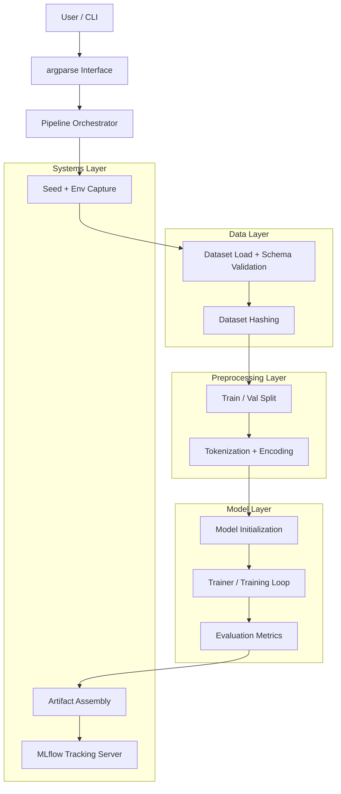

# The Automated Sentiment Intelligence Engine (ASIE)
## 📌 Overview

ASIE (Automated Sentiment Intelligence Engine) is a production-oriented ML system for training, tracking, and eventually serving NLP sentiment models. Instead of a notebook-style experiment, ASIE is designed as a modular, reproducible, and testable pipeline with explicit lifecycle control, experiment tracking, and operational metadata capture.<br>
The goal is to treat ML as a software system, not just a training script.

## 🎯 Milestone-1 System Goals

- Modular pipeline design
- Reproducible training runs
- Configuration-driven execution
- Experiment tracking and artifact persistence
- System-level testing
- Extensibility toward serving and deployment


## 🏗 Architecture (Week-1: Training System)
Week-1 establishes the training and experimentation layer of ASIE.<br>
ASIE executes as a Python application:<br>

```bash
python -m pipeline
```
The training pipeline is organized into clear layers:<br>
```powershell
CLI → Orchestrator → Data → Preprocessing → Model → Evaluation → Artifacts → Tracking
```

---

## 🔁 Training Pipeline Flow


## 🧩 Component Responsibilities

### CLI Interface
Controls runtime behavior via `argparse`. Configuration is injected at runtime, separating system logic from experiment parameters.

### Pipeline Orchestrator
`pipeline.py` coordinates the lifecycle of a run: ingestion → preprocessing → training → evaluation → logging. It acts as ASIE’s control plane.

### Data Layer
- CSV ingestion
- Schema validation
- Dataset hashing
Guarantees input correctness and enables reproducibility across runs.

### Preprocessing Layer
- Train/validation split
- Tokenization
- Dataset construction
Transforms raw text into model-ready representations.

### Model Layer
- Model initialization
- Trainer configuration
- Training loop
- Metric computation
Encapsulates ML logic independent of orchestration and logging.

### Systems Layer
- Seed control
- Environment capture
- Artifact assembly
- MLflow experiment tracking
Provides operational guarantees: reproducibility, traceability, and observability.

## 🧬 Reproducibility & Experiment Tracking
Each ASIE run logs:
- Dataset hash
- Runtime configuration
- Environment snapshot
- Git commit hash
- Metrics
- Auxiliary artifacts
MLflow is used as the experiment backend, enabling inspection, comparison, and lifecycle tracking of training runs.

## 🧪 Testing
ASIE includes a system-level smoke test using pytest that validates full pipeline execution via the CLI:
```python
python -m pytest -v
```
The test launches ASIE using:
```python
subprocess.run([sys.executable, "-m", "src.pipeline", "--epochs", "1"])
```
This validates packaging, imports, environment consistency, and runtime correctness.

## 🛣 Roadmap

- [x] Modular training pipeline
- [x] CLI execution
- [x] MLflow tracking
- [x] Artifact persistence
- [x] Reproducibility metadata
- [x] System-level tests
- [ ] Model serving API (FastAPI)
- [ ] Inference lifecycle
- [ ] Request logging
- [ ] Containerization
- [ ] Deployment architecture

## 🚀 Running ASIE
Run training:
```bash
python -m pipeline
```
Run tests:
```bash
python -m pytest -v
```