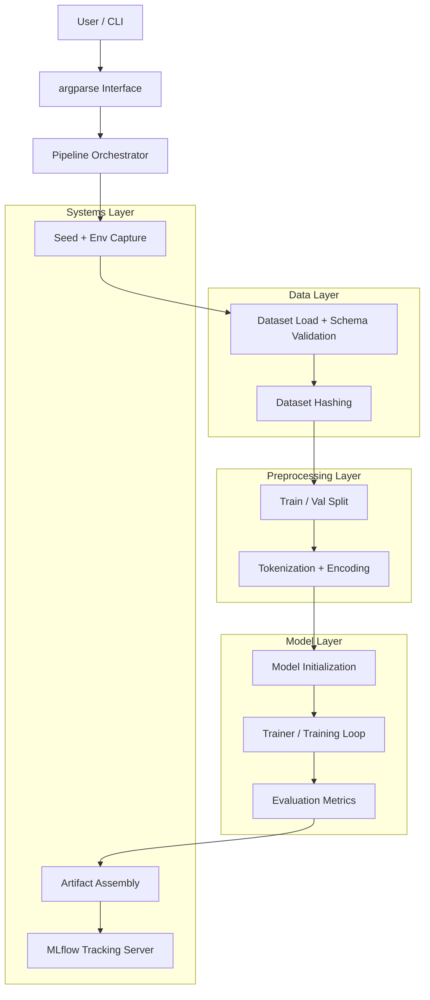
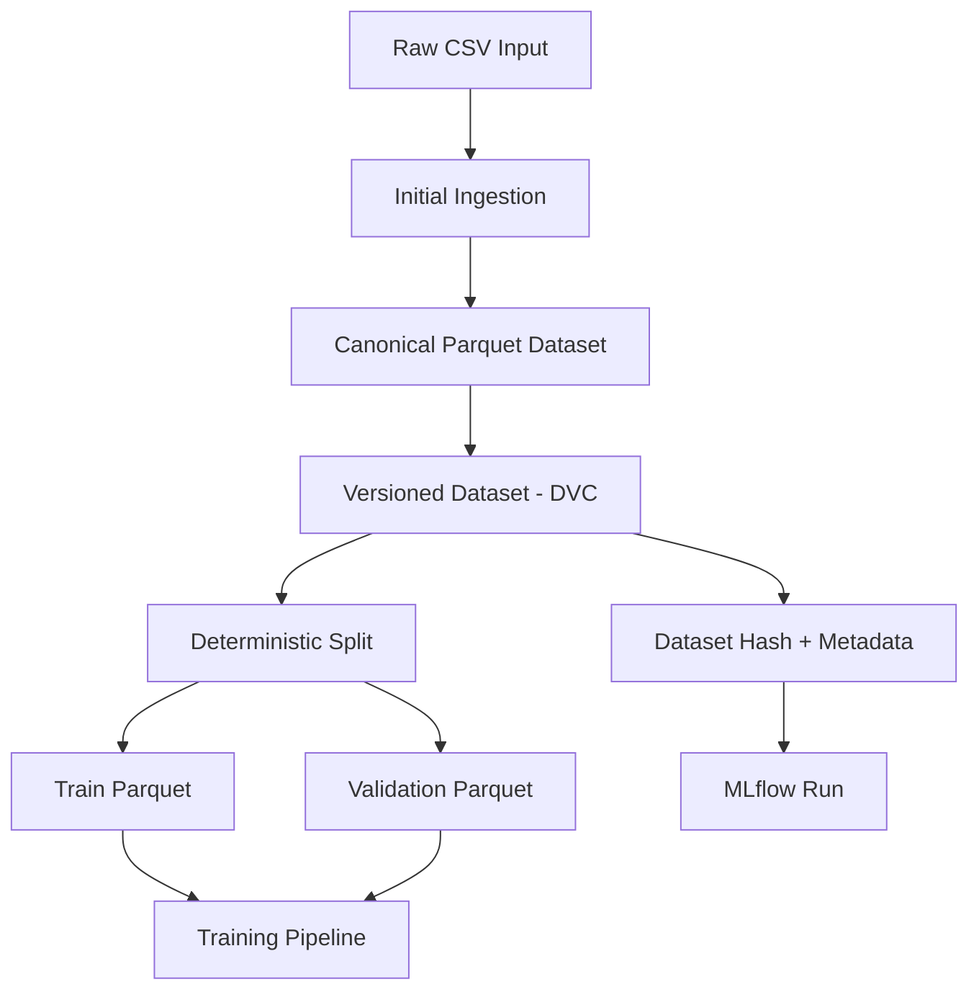

# The Automated Sentiment Intelligence Engine (ASIE)
## 📌 Overview

ASIE (Automated Sentiment Intelligence Engine) is a production-oriented ML system for training, tracking, and eventually serving NLP sentiment models. Instead of a notebook-style experiment, ASIE is designed as a modular, reproducible, and testable pipeline with explicit lifecycle control, experiment tracking, and operational metadata capture.<br>
The goal is to treat ML as a software system, not just a training script.

## 🎯 Milestone-1 System Goals

- Modular pipeline design
- Reproducible training runs
- Configuration-driven execution
- Experiment tracking and artifact persistence
- System-level testing
- Extensibility toward serving and deployment


## 🏗 Architecture (Week-1: Training System)
Week-1 establishes the training and experimentation layer of ASIE.<br>
ASIE executes as a Python application:<br>

```bash
python -m pipeline
```
The training pipeline is organized into clear layers:<br>
```powershell
CLI → Orchestrator → Data → Preprocessing → Model → Evaluation → Artifacts → Tracking
```

---

### 🔁 Training Pipeline Flow


### 🧩 Component Responsibilities

#### CLI Interface
Controls runtime behavior via `argparse`. Configuration is injected at runtime, separating system logic from experiment parameters.

#### Pipeline Orchestrator
`pipeline.py` coordinates the lifecycle of a run: ingestion → preprocessing → training → evaluation → logging. It acts as ASIE’s control plane.

### Data Layer
- CSV ingestion
- Schema validation
- Dataset hashing
Guarantees input correctness and enables reproducibility across runs.

#### Preprocessing Layer
- Train/validation split
- Tokenization
- Dataset construction
Transforms raw text into model-ready representations.

#### Model Layer
- Model initialization
- Trainer configuration
- Training loop
- Metric computation
Encapsulates ML logic independent of orchestration and logging.

#### Systems Layer
- Seed control
- Environment capture
- Artifact assembly
- MLflow experiment tracking
Provides operational guarantees: reproducibility, traceability, and observability.

### 🧬 Reproducibility & Experiment Tracking
Each ASIE run logs:
- Dataset hash
- Runtime configuration
- Environment snapshot
- Git commit hash
- Metrics
- Auxiliary artifacts
MLflow is used as the experiment backend, enabling inspection, comparison, and lifecycle tracking of training runs.

### 🧪 Testing
ASIE includes a system-level smoke test using pytest that validates full pipeline execution via the CLI:
```python
python -m pytest -v
```
The test launches ASIE using:
```python
subprocess.run([sys.executable, "-m", "src.pipeline", "--epochs", "1"])
```
This validates packaging, imports, environment consistency, and runtime correctness.

### 🛣 Roadmap

- [x] Modular training pipeline
- [x] CLI execution
- [x] MLflow tracking
- [x] Artifact persistence
- [x] Reproducibility metadata
- [x] System-level tests
- [ ] Model serving API (FastAPI)
- [ ] Inference lifecycle
- [ ] Request logging
- [ ] Containerization
- [ ] Deployment architecture

### 🚀 Running ASIE
Run training:
```bash
python -m pipeline
```
Run tests:
```bash
python -m pytest -v
```

## Data Versioning & Dataset Lifecycle (Week 2)

Week-2 focusses on <strong>data as a first-class system artifact.</strong> While week-1 stabilized training execution, week-2 ensures that <strong>datasets, splits, and transformations are versioned, reproducible, and auditable</strong> &mdash; independent of model code.<br>
<br>
This week deliberately <strong>preceeds model registry automation and serving</strong>, establishing a solid data contract first.

### 🎯 Week-2 Goals
- Dataset versioning via DVC
- Deterministic train/validation splits
- Parquet-based internal data format
- Clear separation between raw, processed, and split datasets
- Dataset lineage tied to experiments
- Registry-ready dataset semantics

### 🗂 Data Lifecycle (Post-Week-2)


### 🧱 Dataset Design Principles
#### Canonical Format
- CSV is used only once (initial ingestion)
- All downstream operations operate on <strong>Parquet</strong>
- Schema consistency is enforced early

#### Determinism
- Train/Validation splits are:
    - Seed-controlled
    - Hash-tracked
    - Fully reproducible
#### Immutability
- Each dataset version is:
    - Content-addressed
    - Stored via DVC
    - Never mutated in place

### 🔁 DVC Integration
ASIE uses <strong>DVC as the dataset registry</strong>, independent of models.<br>
Tracked artifacts include:
- Canonical dataset parquet
- Split datasets (train + val)
- Split configuration
- Dataset metadata
Typical workflow:
```bash
dvc add data/preprocessed/
git add data/preprocessed.dvc
git commit -m "Add versioend dataset vX"
```
This enables:
- Dataset rollback
- Dataset diffing
- Expermient reproduccibility across machines

### 🧬 Dataset ↔ Experiment Linkage
Each training run logs:
- Dataset version hash
- Split seed
- Dataset path (DVC-tracked)
- Schema signature
This creates a <strong>hard link</strong> between:
```scss
(model, metrics) ←→ (exact dataset version)
```

### 🧪 Validation & Safety
Week-2 introduces:
- Schema validation on load
- Explicit failure on mismatched schemas
- Clear error boundaries between data and model layers
This prevents:
- Silent data drift
- Accidental retraining on modified data
- Inconsistent experiment result

### 🚫 Explicitly Deferred (By Design)
The following are <strong>intentionally postponed</strong> until data stability is guaranteed:
- ❌ Automatic MLflow Model Registry
- ❌ Batch inference
- ❌ Serving infrastructure
- ❌ Promotion automation
These will resume after inference correctness is proven.