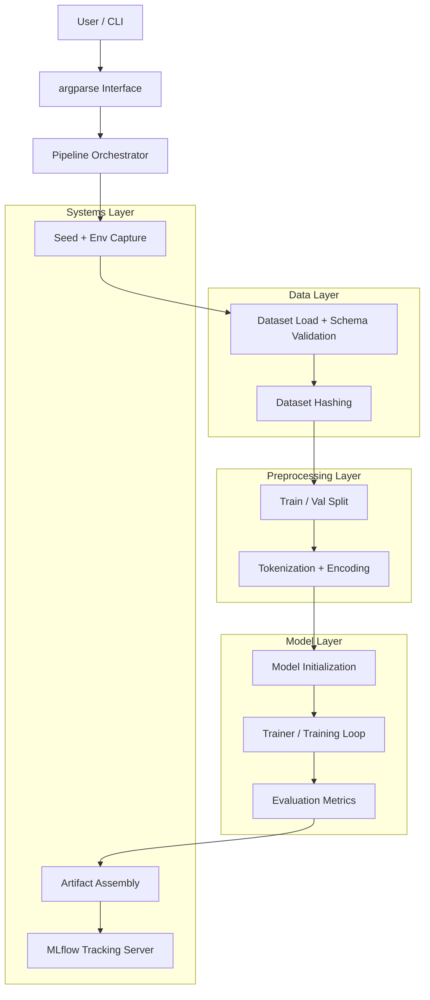
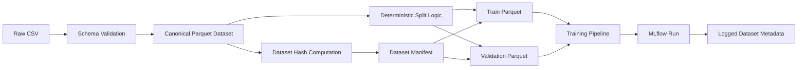
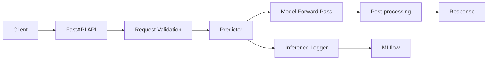

# The Automated Sentiment Intelligence Engine (ASIE)
## 📌 Overview

ASIE (Automated Sentiment Intelligence Engine) is a production-oriented ML system for training, tracking, and eventually serving NLP sentiment models. Instead of a notebook-style experiment, ASIE is designed as a modular, reproducible, and testable pipeline with explicit lifecycle control, experiment tracking, and operational metadata capture.<br>
The goal is to treat ML as a software system, not just a training script.

## 🎯 Milestone-1 System Goals

- Modular pipeline design
- Reproducible training runs
- Configuration-driven execution
- Experiment tracking and artifact persistence
- System-level testing
- Extensibility toward serving and deployment


## 🏗 Architecture (Week-1: Training System)
Week-1 establishes the training and experimentation layer of ASIE.<br>
ASIE executes as a Python application:<br>

```bash
python -m pipeline
```
The training pipeline is organized into clear layers:<br>
```powershell
CLI → Orchestrator → Data → Preprocessing → Model → Evaluation → Artifacts → Tracking
```

---

## 🔁 Training Pipeline Flow


## 🧩 Component Responsibilities

### CLI Interface
Controls runtime behavior via `argparse`. Configuration is injected at runtime, separating system logic from experiment parameters.

### Pipeline Orchestrator
`pipeline.py` coordinates the lifecycle of a run: ingestion → preprocessing → training → evaluation → logging. It acts as ASIE’s control plane.

### Data Layer
- CSV ingestion
- Schema validation
- Dataset hashing
Guarantees input correctness and enables reproducibility across runs.

### Preprocessing Layer
- Train/validation split
- Tokenization
- Dataset construction
Transforms raw text into model-ready representations.

### Model Layer
- Model initialization
- Trainer configuration
- Training loop
- Metric computation
Encapsulates ML logic independent of orchestration and logging.

### Systems Layer
- Seed control
- Environment capture
- Artifact assembly
- MLflow experiment tracking
Provides operational guarantees: reproducibility, traceability, and observability.

## 🧬 Reproducibility & Experiment Tracking
Each ASIE run logs:
- Dataset hash
- Runtime configuration
- Environment snapshot
- Git commit hash
- Metrics
- Auxiliary artifacts
MLflow is used as the experiment backend, enabling inspection, comparison, and lifecycle tracking of training runs.

## 🧪 Testing
ASIE includes a system-level smoke test using pytest that validates full pipeline execution via the CLI:
```python
python -m pytest -v
```
The test launches ASIE using:
```python
subprocess.run([sys.executable, "-m", "src.pipeline", "--epochs", "1"])
```
This validates packaging, imports, environment consistency, and runtime correctness.

## 🚀 Running ASIE
Run training:
```bash
python -m pipeline
```
Run tests:
```bash
python -m pytest -v
```

## 📦 Week 2 — Data Versioning & Dataset Identity

Week 2 focuses on treating data as a first-class system, independent of training code or experiment tracking.<br>

The central realization in this phase is:

<strong>Reproducibility starts before MLflow.</strong>

Instead of treating datasets as files, ASIE treats datasets as identified, versioned artifacts with explicit structure and lineage.

### 🔒 Canonical Data Rules

From Week 2 onward, the system enforces the following rules:
- CSV is ingestion-only
- Parquet is the canonical dataset format
- All training, evaluation, and inference use Parquet only
- Dataset identity is derived from content, not filenames
- Train/validation/test splits are part of the dataset itself
<p>Once data is converted to Parquet, CSV files are never referenced again.</p>

### 🔁 Data Flow
```text
Raw CSV (one-time ingestion)
        ↓
Schema Validation
        ↓
Canonical Parquet Dataset
        ↓
Versioned Parquet Splits (train / val / test)
```
<p> This flow ensures that downstream pipelines are insulated from raw data instability.</p>

### 🧬 Dataset Identity

Each dataset version is uniquely defined by:
- Parquet content hash
- Explicit schema
- Deterministic split logic
- Dataset manifest
<br>
This guarantees that:
- Any training run can be traced to a specific dataset version
- Data leakage is structurally prevented
- Dataset evolution is explicit and auditable
<p>Filenames and directory names are treated as implementation details, not identity.</p>

### 🧬 Dataset Lifecycle


### 🧾 Manifest as the Source of Truth

A dataset manifest records:
- Dataset version
- Parquet file paths
- Split definitions
- Hashes
<br>All downstream systems (training, evaluation, inference) reference the manifest rather than raw files.</p>
This ensures that:
- Changes to data are intentional
- Dataset evolution is observable
- Pipelines fail fast on mismatch

### 📦 Versioning Strategy

Parquet datasets are versioned using DVC, allowing:
- Lightweight tracking of large files
- Clear separation between code and data
- Reproducible dataset checkout by version
<p>
The repository never commits large data files directly.

### 🔗 Preparing for MLflow Integration

By enforcing dataset identity before experiment tracking, MLflow runs can later log:
- Dataset version
- Parquet hash
- Split paths
<br>
This eliminates ambiguity around:
- which CSV was used
- which preprocessing logic ran
- which split logic applied
<p>
MLflow becomes a consumer of data lineage, not its owner.

### 🧠 Key Learnings
- Datasets have identity
- Hash > filename
- Splits are part of the dataset, not training
- Reproducibility begins before model training
- Data systems must be stable before model systems
<p>
This phase establishes the foundation required for reliable model comparison, promotion, and deployment.


## 🚀 Week 3 — Inference & Serving Layer

Week 3 focuses on model consumption, not model creation.<p>
With dataset identity and reproducibility established in Week 2, the system shifts from offline correctness to online reliability. The goal of this phase is to expose trained models via a production-style inference service that is fast, observable, and safe to operate.

### 🎯 Objectives

The serving layer is designed to:
- Load models deterministically at startup
- Avoid cold-start latency
- Support single and batch inference
- Measure inference performance
- Log prediction metadata independently of training
- Remain decoupled from data preparation logic
<p>
Week 3 treats the model as an immutable artifact produced upstream.

### 🏗 Serving Architecture

<p>
The serving layer is intentionally thin and modular. Each component has a single responsibility and can be reasoned about independently.

### 🔁 Application Lifecycle

Model loading is performed during application startup.
```text
Process start
   ↓
Resolve model artifact
   ↓
Download artifacts
   ↓
Load model into memory
   ↓
API becomes ready
```

This guarantees that:
- The model is loaded exactly once
- Requests never trigger model initialization
- Readiness checks reflect real availability

### 🧱 Core Components
#### ModelLoader
Responsible for model lifecycle management.<p>
Responsibilities
- Resolve MLflow artifact URIs
- Download model artifacts
- Load the model into memory
- Select execution device (CPU / CUDA)
<p> Model loading failures surface during startup rather than at inference time.

#### Predictor
Encapsulates all inference logic.<p>
Responsibilities
- Input normalization
- Tokenization
- Batch-aware inference
- Post-processing predictions
- Measuring inference latency
<p> The predictor is stateless, allowing safe reuse across requests.<br>
Batching is handled internally and does not change the API contract.

#### InferenceLogger
Provides observability for online predictions.<p>
Responsibilities
- Log inference metadata to MLflow
- Capture latency and confidence scores
- Preserve model lineage via run IDs
<p>Each inference is logged as a separate MLflow run, preventing parameter collisions and ensuring traceability.<br>
Logging failures do not affect prediction responses.

### 🔌 API Endpoints
<strong>Health Check</strong><br>
Used for readiness probes and operational monitoring.
```http
GET /health
```
**Response**
```json
{
  "status": "ok",
  "model_loader": true,
  "device": "cuda",
  "run_id": "7eb939db74994011841608b40992a2a1"
}
```
---
<strong>Single Prediction</strong>
```http
POST /predict
```
**Request**
```json
{
    "text": "Markets look strong today"
}
```
**Response**
```json
{
  "label": "positive",
  "score": 0.97,
  "latency_ms": 12.4,
  "model_version": "v0"
}
```
---
<strong>Batch Prediction</strong>
The same endpoint supports batch inference.
```http
POST /predict
```
**Request**
```json
{
	"text": [
		"Markets reacted positively to the earnings report",
        "The company reported heavy quarterly losses",
        "Revenue growth exceeded expectations"
	]
}
```
**Response**
```json
{
	"predictions":[
		{"label":"LABEL_2","score":0.9916867613792419},
		{"label":"LABEL_0","score":0.9920489192008972},
		{"label":"LABEL_2","score":0.9911454319953918}
	],
	"model_version":"v0",
	"latency_ms":755.9084892272949
}
```
Batching improves throughput and GPU utilization without changing client behavior.

### ⚡ Performance Considerations
#### Batching
- Requests are dynamically batched
- Tokenization and inference are vectorized
- A single forward pass serves multiple inputs
<p>This reduces per-sample overhead and improves GPU efficiency.</p>

#### Latency Measurement
Latency is measured inside the inference path and includes:
- Tokenization
- Model forward pass
- Post-processing
<br> It explicitly excludes:
- Network IO
- JSON serialization
- Logging overhead
<p> This ensures metrics reflect model performance, not transport noise.</p>

#### Concurrency Model
- FastAPI handles request IO asynchronously
- PyTorch inference runs synchronously
- Compute and IO are intentionally separated
<p> This avoids race conditions while preserving concurrency for inbound traffic. </p>

### 🔍 Observability & Monitoring
MLflow is used as a lightweight observability layer for inference.<br>
Each prediction logs:
- latency_ms
- score
- input length
- predicted label
- model run ID<br>
This enables:
- Latency analysis
- Confidence distribution inspection
- Model behavior auditing over time
<p> Inference logging is intentionally decoupled from training runs.</p>