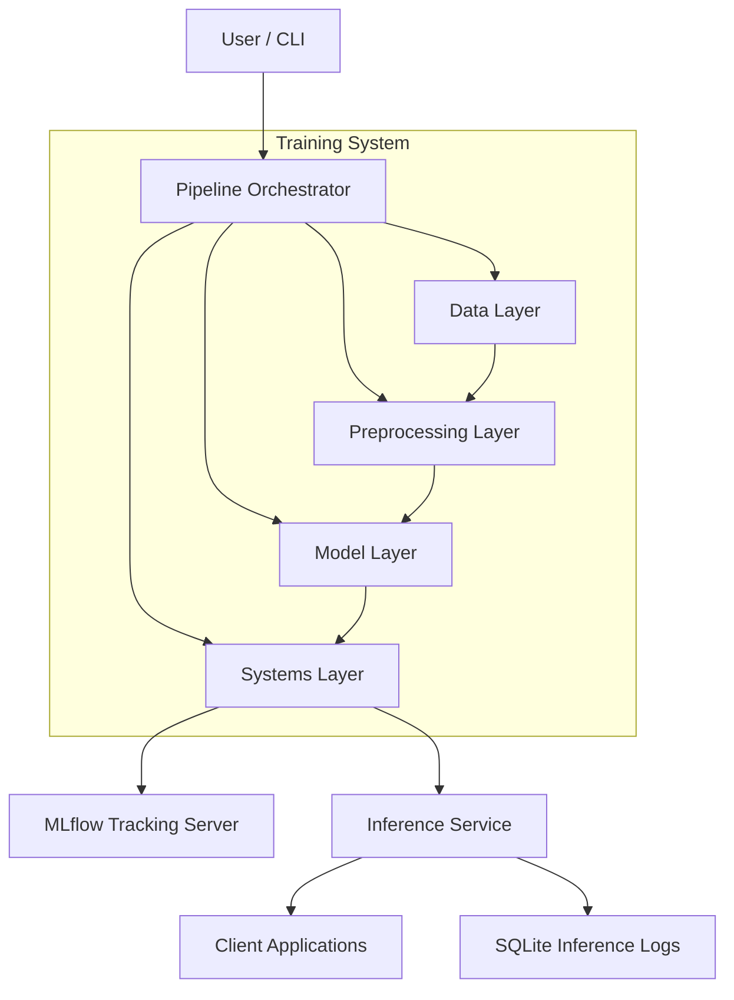
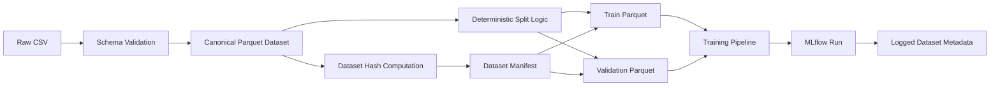
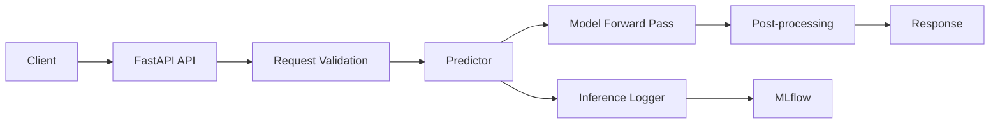
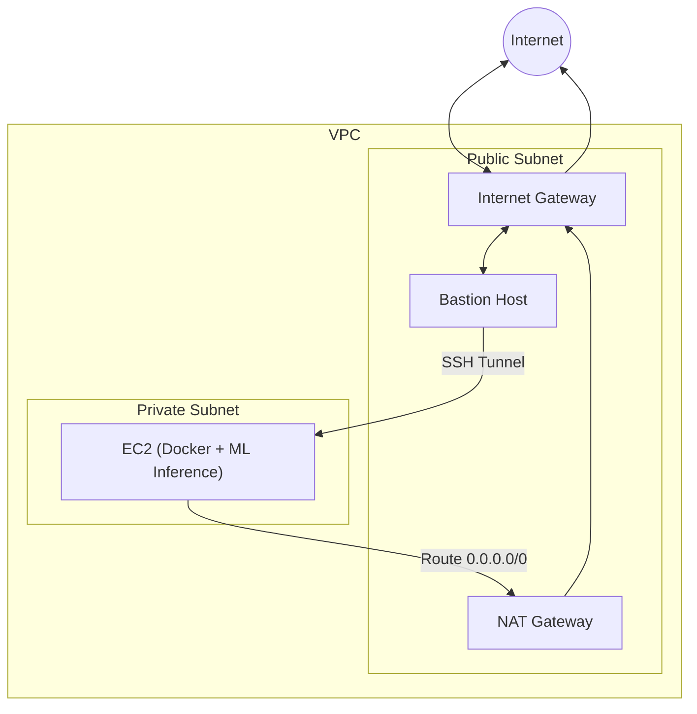

# Automated Sentiment Intelligence Engine (ASIE)

## 🚀 Product Overview

The Automated Sentiment Intelligence Engine (ASIE) is a production-grade Machine Learning Operations (MLOps) system designed for the end-to-end lifecycle management of Natural Language Processing (NLP) sentiment models. Moving beyond traditional notebook-style experimentation, ASIE provides a modular, reproducible, and testable pipeline that treats machine learning as a robust software system rather than a collection of isolated scripts. It ensures explicit lifecycle control, comprehensive experiment tracking, and meticulous operational metadata capture, enabling reliable development, deployment, and monitoring of sentiment analysis capabilities.

ASIE's core value proposition lies in its ability to deliver:
- **Reproducible ML Experiments**: Guaranteeing that every training run can be recreated and traced.
- **Robust Data Governance**: Ensuring data integrity, versioning, and lineage.
- **Secure & Scalable Inference**: Deploying models in a production-ready, secure, and observable environment.
- **Operational Excellence**: Providing tools for system-level testing, environment capture, and artifact management.

## 🎯 Key Capabilities

ASIE offers a suite of features engineered for MLOps maturity:

- **Modular Pipeline Design**: A clearly layered architecture for data ingestion, preprocessing, model training, evaluation, and logging.
- **Configuration-Driven Execution**: Separating system logic from experiment parameters for flexible and controlled runs.
- **Comprehensive Experiment Tracking**: Leveraging MLflow for logging dataset hashes, runtime configurations, environment snapshots, Git commit hashes, metrics, and auxiliary artifacts.
- **Immutable Model Promotion**: A defined process to convert experimental runs into approved, versioned release artifacts for serving.
- **Advanced Data Versioning**: Treating datasets as identified, versioned artifacts with explicit structure and lineage, independent of training code.
- **Secure Cloud Deployment**: Implementing robust AWS infrastructure patterns including private subnets, bastion hosts, ECR, and IAM roles for credential-free operations.
- **Structured Inference Logging**: Dedicated SQLite-based logging for online predictions, capturing detailed metadata, latency, and confidence scores.
- **Safe Shadow Deployment**: Enabling silent execution of new model versions alongside primary models for performance comparison and risk mitigation without impacting live traffic.

## 🏗 System Architecture

ASIE is structured into distinct, interconnected layers that ensure modularity, scalability, and maintainability. The system operates as a Python application, with key components orchestrating the ML lifecycle from data to deployment.

### High-Level Flow



### Component Breakdown

#### Training System

This layer focuses on the development and evaluation of sentiment models.

-   **CLI Interface**: Controls runtime behavior and injects configuration, ensuring separation of system logic from experiment parameters.
-   **Pipeline Orchestrator (`pipeline.py`)**: Coordinates the entire lifecycle of a training run: ingestion → preprocessing → training → evaluation → logging.
-   **Data Layer**: Handles CSV ingestion, schema validation, and dataset hashing, guaranteeing input correctness and reproducibility.
-   **Preprocessing Layer**: Manages train/validation splits, tokenization, and dataset construction, transforming raw text into model-ready representations.
-   **Model Layer**: Encapsulates ML logic, including model initialization, trainer configuration, the training loop, and metric computation.
-   **Systems Layer**: Provides operational guarantees through seed control, environment capture, artifact assembly, and MLflow experiment tracking.

#### Data Management

ASIE treats data as a first-class, versioned artifact, ensuring reproducibility and traceability. The system enforces canonical data rules:

-   **CSV is Ingestion-Only**: Raw CSV files are used for one-time ingestion.
-   **Parquet as Canonical Format**: All training, evaluation, and inference exclusively use Parquet datasets.
-   **Content-Derived Identity**: Dataset identity is derived from content hashes, not filenames.
-   **Integrated Splits**: Train/validation/test splits are an intrinsic part of the dataset itself.

This flow ensures downstream pipelines are insulated from raw data instability.



-   **Dataset Manifest**: A central source of truth recording dataset version, Parquet file paths, split definitions, and hashes. All downstream systems reference this manifest.
-   **Versioning Strategy**: Parquet datasets are versioned using DVC, enabling lightweight tracking of large files and reproducible dataset checkout.

#### Model Promotion

ASIE implements a rigorous model promotion architecture to bridge the gap between experimental training runs and production-ready serving. This process ensures that inference services consume immutable, portable release artifacts, free from runtime dependencies on MLflow tracking infrastructure.

-   **Concept**: An `ExperimentRun` is explicitly converted into an `ApprovedReleaseArtifact`.
-   **Immutability**: Promotion freezes exact model weights, tokenizer, and configuration, akin to tagging a Git release.
-   **Serving Independence**: Docker images for serving contain only the necessary model and tokenizer artifacts, eliminating MLflow imports, tracking URIs, and runtime artifact downloads. This results in immutable, deterministic, portable, and infrastructure-independent containers.

#### Inference & Serving Layer

This layer exposes trained models via a fast, observable, and safe production-style inference service. It is designed for model consumption, treating the model as an immutable artifact produced upstream.

-   **Serving Architecture**: A thin, modular FastAPI-based service handles requests, validation, prediction, and post-processing.



-   **Application Lifecycle**: Models are loaded deterministically during application startup, ensuring no cold-start latency and accurate readiness checks.
-   **Core Components**:
    -   **ModelLoader**: Manages model lifecycle, resolving MLflow artifact URIs, downloading, and loading models into memory.
    -   **Predictor**: Encapsulates all inference logic, including input normalization, tokenization, batch-aware inference, and post-processing.
    -   **InferenceLogger**: Provides observability by logging inference metadata, latency, and confidence scores to MLflow, ensuring traceability without affecting prediction responses.

### Secure Cloud Deployment (AWS)

ASIE's deployment strategy on AWS prioritizes security, isolation, and credential hygiene, moving towards a fully AWS-native and credential-free operational model.

-   **Network Isolation**: Deployment within a custom Virtual Private Cloud (VPC) featuring:
    -   **Public Subnet**: Hosts a Bastion Host for secure SSH access (from authorized IPs only).
    -   **Private Subnet**: Contains the EC2 instance running the Dockerized ML inference service, with no public IP exposure.
    -   **NAT Gateway**: Enables outbound internet access for the private subnet.
    -   **Security Groups**: Rigorously configured to allow SSH only from the Bastion to the private EC2, and API access (Port 8000) only from the Bastion.



-   **Credential-Free Operations**: Eliminating static AWS credentials and DockerHub dependencies:
    -   **AWS ECR**: Private Docker image registry for secure image storage.
    -   **IAM Roles for EC2**: EC2 instances assume IAM roles with specific permissions (e.g., `AmazonEC2ContainerRegistryReadOnly`) to pull images from ECR and interact with other AWS services. This removes the need for storing access keys on the instance.
    -   **Temporary STS Credentials**: Docker login uses temporary Security Token Service (STS) credentials, ensuring no long-lived secrets are exposed.

-   **Safe Shadow Deployment**: A robust mechanism for deploying and evaluating new model versions in production without risk:
    -   **Dual Model Setup**: Primary and Shadow models are loaded at startup.
    -   **Graceful Degradation**: Shadow model loading and execution are wrapped in `try/except` blocks; failures do not impact the primary service.
    -   **Structured Logging**: Detailed metrics on disagreement, score differences, and latencies for both primary and shadow models are logged to a dedicated SQLite database, enabling offline analysis and promotion readiness evaluation.

## 🛠 How to Use ASIE

### Running the Training Pipeline

To execute the full training pipeline:

```bash
python -m pipeline
```

### Running Tests

ASIE includes a system-level smoke test using `pytest` to validate full pipeline execution via the CLI:

```bash
python -m pytest -v
```

This test verifies packaging, imports, environment consistency, and runtime correctness.

### Manual Model Promotion

Currently, model promotion is a manual process. After a training pipeline run, the user or administrator must manually update the `./model/model_registry.yaml` file with the details of the new primary and shadow models. This includes updating their respective run IDs, versions, hashes, and key metrics.

This step ensures that the inference service loads the correct and desired model versions for serving.

### Interacting with the Inference Service

Once the inference service is deployed (e.g., on an AWS EC2 instance within a private subnet), you can interact with it securely via an SSH tunnel through the bastion host:

```bash
ssh -i <your-key-pair>.pem -L 8000:PRIVATE_EC2_IP:8000 ec2-user@BASTION_PUBLIC_IP
```

After establishing the tunnel, the inference service will be accessible locally:

-   **Health Check**:
    ```http
    GET http://localhost:8000/health
    ```
    **Example Response**:
    ```json
    {
      "status": "ok",
      "model_loader": true,
      "device": "cuda",
      "run_id": "7eb939db74994011841608b40992a2a1"
    }
    ```

-   **Single Prediction**:
    ```http
    POST http://localhost:8000/predict
    Content-Type: application/json

    {
      "text": ["This is a sample text for sentiment analysis."]
    }
    ```
    **Example Response**:
    ```json
    {
      "prediction": "positive",
      "confidence": 0.98,
      "latency_ms": 12.5
    }
    ```

## ✨ Benefits of ASIE

ASIE provides a robust foundation for building and operating reliable ML systems, offering significant advantages for MLOps practitioners:

-   **Enhanced Reproducibility**: Every aspect of the ML lifecycle, from data to model, is versioned and traceable.
-   **Increased Reliability**: Deterministic model loading, immutable artifacts, and isolated serving environments minimize production risks.
-   **Improved Security**: Credential-free AWS deployment, network isolation, and secure access patterns protect sensitive data and models.
-   **Streamlined Operations**: Automated experiment tracking, structured inference logging, and safe shadow deployments simplify monitoring and model evaluation.
-   **Scalability & Maintainability**: Modular architecture and clear separation of concerns facilitate easier development, testing, and scaling of ML capabilities.

ASIE transforms the development of sentiment analysis models into a mature, software-engineered process, ready for demanding production environments.

## 🚧 Work in Progress

ASIE is continuously evolving to incorporate advanced MLOps practices and enhance its production readiness. Current development efforts are focused on:

1.  **Kubernetes (EKS) and Helm Deployment**: Transitioning to container orchestration with Amazon Elastic Kubernetes Service (EKS) for scalable and resilient deployments, managed via Helm charts for simplified application packaging and deployment.
2.  **Drift Detection and Monitoring**: Implementing robust drift detection mechanisms using tools like Evidently AI to monitor model performance degradation over time. This includes calculating drift metrics and exploring synthetic slang injection for proactive testing.
3.  **Alerts & Triggers with Prometheus and Grafana**: Establishing a comprehensive monitoring and alerting system. Drift detection will trigger webhooks, feeding data into Prometheus for time-series monitoring, visualized and alerted through Grafana.
4.  **Automated Retraining (Closed Training Loop)**: Developing a fully automated retraining pipeline, orchestrated by Airflow DAGs, to create a closed-loop system for continuous model improvement. This involves automated data fetching, training, evaluation, and model registration.
5.  **Production-Real Retraining**: Optimizing the retraining process for production environments, including leveraging GPU jobs, FP16 precision for faster training, and utilizing AWS spot instances for cost-efficiency.
6.  **GitOps Deployment (Automated Model Rollout)**: Implementing GitOps principles with ArgoCD to automate model rollouts, enabling controlled rolling updates and streamlined model promotion across different environments.