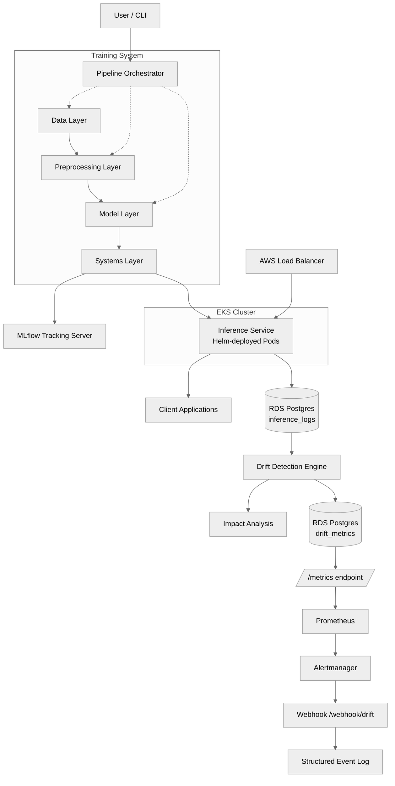
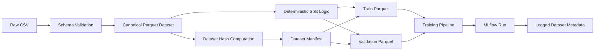
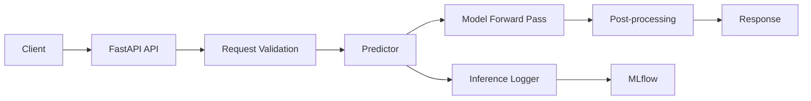
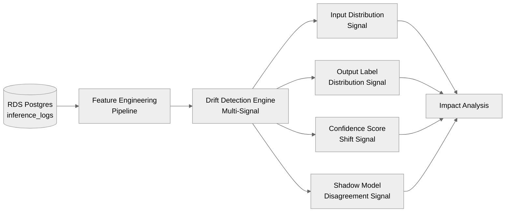
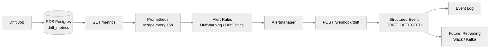
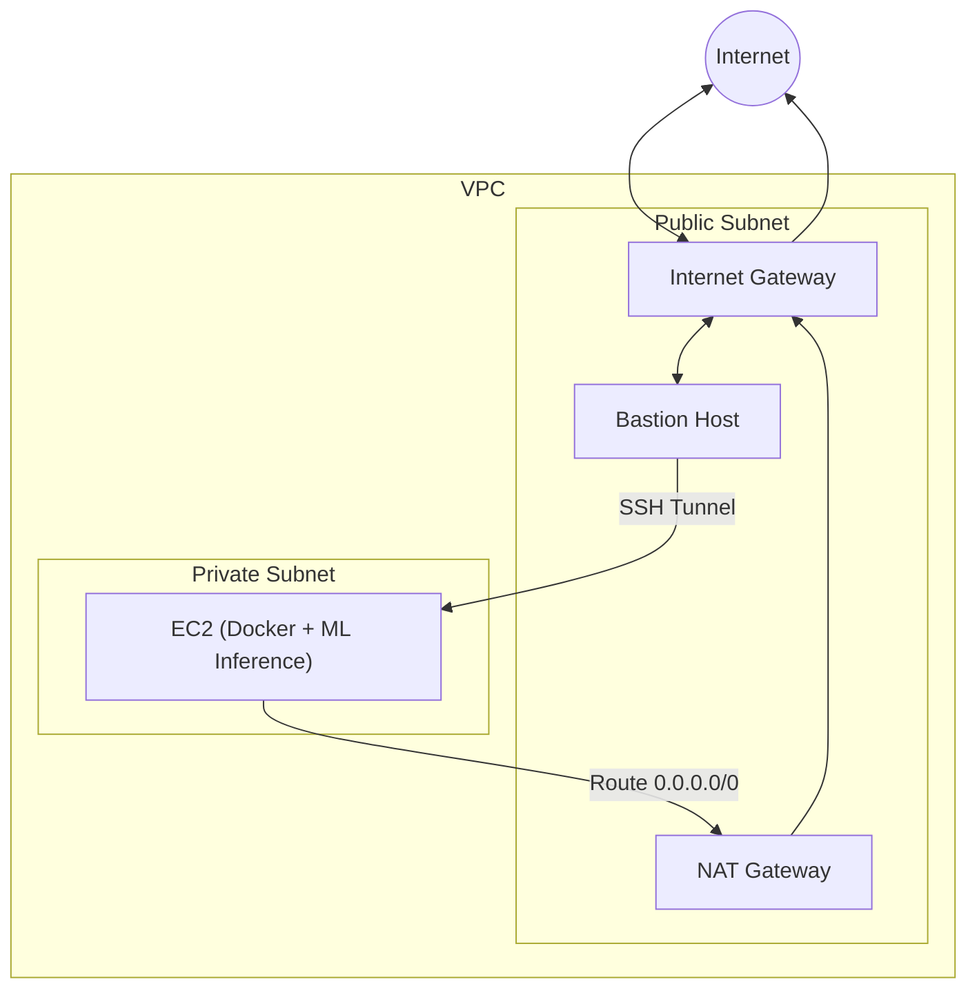
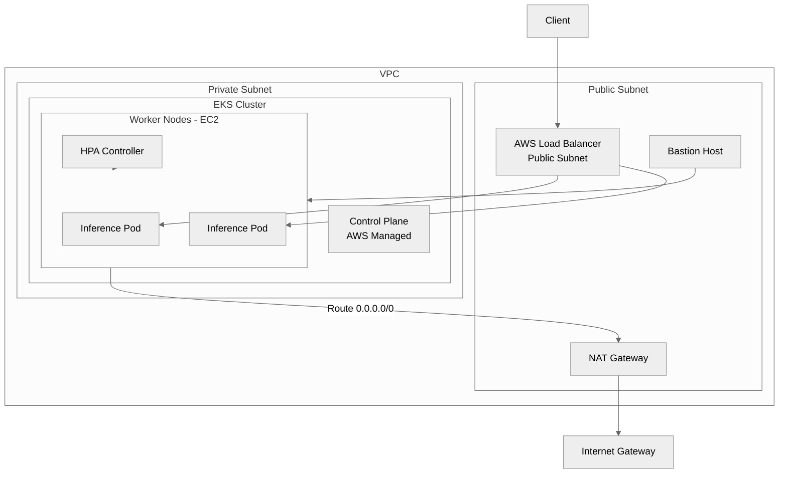

# Automated Sentiment Intelligence Engine (ASIE)

## 🚀 Product Overview

The Automated Sentiment Intelligence Engine (ASIE) is a production-grade Machine Learning Operations (MLOps) system designed for the end-to-end lifecycle management of Natural Language Processing (NLP) sentiment models. Moving beyond traditional notebook-style experimentation, ASIE provides a modular, reproducible, and testable pipeline that treats machine learning as a robust software system rather than a collection of isolated scripts. It ensures explicit lifecycle control, comprehensive experiment tracking, and meticulous operational metadata capture, enabling reliable development, deployment, and monitoring of sentiment analysis capabilities.

ASIE's core value proposition lies in its ability to deliver:
- **Reproducible ML Experiments**: Guaranteeing that every training run can be recreated and traced.
- **Robust Data Governance**: Ensuring data integrity, versioning, and lineage.
- **Secure & Scalable Inference**: Deploying models in a production-ready, secure, and observable environment.
- **Operational Excellence**: Providing tools for system-level testing, environment capture, and artifact management.

## 🎯 Key Capabilities

ASIE offers a suite of features engineered for MLOps maturity:

- **Modular Pipeline Design**: A clearly layered architecture for data ingestion, preprocessing, model training, evaluation, and logging.
- **Configuration-Driven Execution**: Separating system logic from experiment parameters for flexible and controlled runs.
- **Comprehensive Experiment Tracking**: Leveraging MLflow for logging dataset hashes, runtime configurations, environment snapshots, Git commit hashes, metrics, and auxiliary artifacts.
- **Immutable Model Promotion**: A defined process to convert experimental runs into approved, versioned release artifacts for serving.
- **Advanced Data Versioning**: Treating datasets as identified, versioned artifacts with explicit structure and lineage, independent of training code.
- **Secure Cloud Deployment**: Implementing robust AWS infrastructure patterns including private subnets, SSM Session Manager access, ECR, and IAM roles for credential-free operations.
- **Kubernetes-Native Orchestration**: Running the inference service on Amazon EKS with Helm-managed deployments, CPU-based autoscaling (HPA), self-healing via probes, and verified zero-downtime rollouts (a preStop drain plus an ALB readiness gate — measured at 150/150 successful requests through a rollout).
- **Structured Inference Logging**: Every prediction is logged to RDS Postgres with the deployed model version, latency, confidence, and primary/shadow disagreement — the evidence the promotion gate later reasons over.
- **Multi-Signal Drift Detection**: A time-windowed drift detection engine that monitors input distribution, output label distribution, confidence score shifts, and shadow model disagreement —  enabling proactive detection of model degradation before accuracy metrics are available.
- **Event-Driven Alerting Pipeline**: Drift metrics are exposed to Prometheus, evaluated against defined alert thresholds, routed through Alertmanager, and delivered to a structured webhook endpoint — transforming passive drift signal into actionable, extensible system events.
- **GitOps Delivery**: ArgoCD reconciles every workload from git — deploying a model is a commit, and rolling back is `git revert`. The deploy script installs ArgoCD and then stops deciding what runs.
- **Progressive Delivery**: Argo Rollouts shifts real traffic 20% → 50% → 100% via ALB weighted target groups, with each step gated on a Prometheus success-rate analysis that aborts the rollout on its own.
- **Evidence-Based Promotion**: A model is promoted only when it beats the incumbent offline *and* proves safe online — sample count, soak duration, failure rate and p95 latency, evaluated against live traffic.
- **Automated Rollback**: A scheduled job reverts a degraded primary by committing the previous version back to git, guarded so it fires only close to a deploy — where the deploy is the likely cause.
- **Safe Shadow Deployment**: Enabling silent execution of new model versions alongside primary models for performance comparison and risk mitigation without impacting live traffic.

## 🏗 System Architecture

ASIE is structured into distinct, interconnected layers that ensure modularity, scalability, and maintainability. The system operates as a Python application, with key components orchestrating the ML lifecycle from data to deployment.

### High-Level Flow


```mermaid
%%{init: {'theme': 'neutral'}}%%
flowchart TD
    User_CLI[User / CLI] --> Orchestrator

    subgraph Training_System [Training System]
        Orchestrator[Pipeline Orchestrator]
        DataLayer[Data Layer]
        PreprocessingLayer[Preprocessing Layer]
        ModelLayer[Model Layer]
        SystemsLayer[Systems Layer]
        
        %% Defining the linear flow
        DataLayer --> PreprocessingLayer --> ModelLayer --> SystemsLayer
    end

    %% Control lines from Orchestrator
    Orchestrator -.-> DataLayer
    Orchestrator -.-> PreprocessingLayer
    Orchestrator -.-> ModelLayer
    
    SystemsLayer --> MLflow[MLflow Tracking Server]
    SystemsLayer --> ServingSystem

    subgraph EKS [EKS Cluster]
        ServingSystem[Inference Service<br/>Helm-deployed Pods]
    end

    ELB[AWS Load Balancer] --> ServingSystem
    ServingSystem --> Client[Client Applications]
    ServingSystem --> InferenceLogs[(RDS Postgres<br/>inference_logs)]
    
    InferenceLogs --> DriftEngine[Drift Detection Engine]
    DriftEngine --> ImpactAnalysis[Impact Analysis]
    DriftEngine --> DriftDB[(RDS Postgres<br/>drift_metrics)]
    
    %% Fixed syntax here
    DriftDB --> MetricsEndpoint[/ "/metrics endpoint" /]
    MetricsEndpoint --> Prometheus[Prometheus]
    Prometheus --> Alertmanager[Alertmanager]
    Alertmanager --> Webhook[Webhook /webhook/drift]
    Webhook --> EventLog[Structured Event Log]
```

### Component Breakdown

#### Training System

This layer focuses on the development and evaluation of sentiment models.

-   **CLI Interface**: Controls runtime behavior and injects configuration, ensuring separation of system logic from experiment parameters.
-   **Pipeline Orchestrator (`pipeline.py`)**: Coordinates the entire lifecycle of a training run: ingestion → preprocessing → training → evaluation → logging.
-   **Data Layer**: Handles CSV ingestion, schema validation, and dataset hashing, guaranteeing input correctness and reproducibility.
-   **Preprocessing Layer**: Manages train/validation splits, tokenization, and dataset construction, transforming raw text into model-ready representations.
-   **Model Layer**: Encapsulates ML logic, including model initialization, trainer configuration, the training loop, and metric computation.
-   **Systems Layer**: Provides operational guarantees through seed control, environment capture, artifact assembly, and MLflow experiment tracking.

#### Data Management

ASIE treats data as a first-class, versioned artifact, ensuring reproducibility and traceability. The system enforces canonical data rules:

-   **CSV is Ingestion-Only**: Raw CSV files are used for one-time ingestion.
-   **Parquet as Canonical Format**: All training, evaluation, and inference exclusively use Parquet datasets.
-   **Content-Derived Identity**: Dataset identity is derived from content hashes, not filenames.
-   **Integrated Splits**: Train/validation/test splits are an intrinsic part of the dataset itself.

This flow ensures downstream pipelines are insulated from raw data instability.


```mermaid
flowchart LR
    RawCSV[Raw CSV] --> SchemaValidation[Schema Validation]
    SchemaValidation --> CanonicalParquet[Canonical Parquet Dataset]

    CanonicalParquet --> DatasetHash[Dataset Hash Computation]
    DatasetHash --> DatasetManifest[Dataset Manifest]

    CanonicalParquet --> DeterministicSplit[Deterministic Split Logic]
    DeterministicSplit --> TrainParquet[Train Parquet]
    DeterministicSplit --> ValidationParquet[Validation Parquet]

    DatasetManifest --> TrainParquet
    DatasetManifest --> ValidationParquet

    TrainParquet --> TrainingPipeline[Training Pipeline]
    ValidationParquet --> TrainingPipeline

    TrainingPipeline --> MLflowRun[MLflow Run]
    MLflowRun --> LoggedMetadata[Logged Dataset Metadata]
```

-   **Dataset Manifest**: A central source of truth recording dataset version, Parquet file paths, split definitions, and hashes. All downstream systems reference this manifest.
-   **Versioning Strategy**: Parquet datasets are versioned using DVC, enabling lightweight tracking of large files and reproducible dataset checkout.

#### Model Promotion

ASIE implements a rigorous model promotion architecture to bridge the gap between experimental training runs and production-ready serving. This process ensures that inference services consume immutable, portable release artifacts, free from runtime dependencies on MLflow tracking infrastructure.

-   **Concept**: An `ExperimentRun` is explicitly converted into an `ApprovedReleaseArtifact`.
-   **Immutability**: Promotion freezes exact model weights, tokenizer, and configuration, akin to tagging a Git release.
-   **Serving Independence**: Docker images for serving contain only the necessary model and tokenizer artifacts, eliminating MLflow imports, tracking URIs, and runtime artifact downloads. This results in immutable, deterministic, portable, and infrastructure-independent containers.

#### Inference & Serving Layer

This layer exposes trained models via a fast, observable, and safe production-style inference service. It is designed for model consumption, treating the model as an immutable artifact produced upstream.

-   **Serving Architecture**: A thin, modular FastAPI-based service handles requests, validation, prediction, and post-processing.


```mermaid
flowchart LR
    Client[Client] --> FastAPI[FastAPI API]
    FastAPI --> RequestValidation[Request Validation]
    RequestValidation --> Predictor[Predictor]
    Predictor --> ModelForwardPass[Model Forward Pass]
    ModelForwardPass --> Postprocessing[Post-processing]
    Postprocessing --> Response[Response]

    Predictor --> InferenceLogger[Inference Logger]
    InferenceLogger --> MLflow[MLflow]
```

-   **Application Lifecycle**: Models are loaded deterministically during application startup, ensuring no cold-start latency and accurate readiness checks.
-   **Core Components**:
    -   **ModelLoader**: Manages model lifecycle, resolving MLflow artifact URIs, downloading, and loading models into memory.
    -   **Predictor**: Encapsulates all inference logic, including input normalization, tokenization, batch-aware inference, and post-processing.
    -   **InferenceLogger**: Provides observability by logging inference metadata, latency, and confidence scores to MLflow, ensuring traceability without affecting prediction responses.

### Drift Detection & Model Monitoring
Machine learning systems degrade silently. Unlike traditional software, failures don't surface as expections or error rates — they appear as gradual shifts in input distributions and quietly drops in prediction quality. ASIE addresses this with a multi-signal drift detection engine that operates over time-windowed batches of logged inference data, providing proactive visibility into model behavior before accuracy degradation becomes critical.

**Why Accuracy Alone Is Insufficient**

In production, ground truth labels are typically delayed or unavailable, making real-time accuracy computation impractical. ASIE instead relies on proxy signals that are immediately observable: changes in input data distribution, shifts in the model's output behavior, declining confidence, and disagreement between the primary and shadow models. Together, these signals provide a leading indicator of degradation rather than a lagging one.

**Drift Signals**

The detection engine monitors *four* complementary signals, each targeting a different failure mode:

-   **Input Feature / Text Distribution**: Tracks shifts in the statistical properties of incoming text — capturing changes in vocabulary, sentence structure, or linguistic patterns that indicate the production data is diverging from training data. This is the earliest-stage signal, detecting drift before it has had any chance to affect model output.

-   **Output Label Distribution**: Monitors the distribution of predicted sentiment labels over time. A model that was previously predicting a balanced mix of classes but has shifted towards near-uniform predictions is exhibiting a meaningful behavioural change, regardless of whether any individual prediction looks wrong.

-   **Confidence Score Shifts**: Treats aggregate confidence as a leading degradation indicator. A well-calibrated model on familiar data produces high-confidence predictions; as inputs drift away from the training distribution, confidence tends to drop measurably before label accuracy does.

-   **Shadow Model Disagreement Rate**: Leverages the existing shadow deployment infrastructure to measure the rate at which the primary and shadow models produce conflicting predictions on identical inputs. Rising disagreement is a direct signal of model instability and a strong prompt for closer investigation.

**Architecture**

The detection pipeline is built as a downstream layer on top of the existing inference logging infrastructure, consuming logged inference records from RDS without touching the serving path.


```mermaid
%%{init: {'theme': 'neutral'}}%%
flowchart LR
    InferenceLogs[(RDS Postgres<br/>inference_logs)] --> FeatureEngineering[Feature Engineering<br/>Pipeline]
    FeatureEngineering --> DriftEngine[Drift Detection Engine<br/>Multi-Signal]
    DriftEngine --> InputDrift[Input Distribution<br/>Signal]
    DriftEngine --> OutputDrift[Output Label<br/>Distribution Signal]
    DriftEngine --> ConfidenceDrift[Confidence Score<br/>Shift Signal]
    DriftEngine --> ShadowDrift[Shadow Model<br/>Disagreement Signal]
    InputDrift --> ImpactAnalysis[Impact Analysis]
    OutputDrift --> ImpactAnalysis
    ConfidenceDrift --> ImpactAnalysis
    ShadowDrift --> ImpactAnalysis
```

-   **Feature Engineering Pipeline**: Pricesses raw inference log entries into structured feature representations suitable for distributional comparison — extracting text embeddings, token statistics, and metadata fields.

-   **Drift Detection Engine**: Applies statistical tests and distributional comparisons across each signal independently, operating over a configurable time window of logged requests.
-   **Batch Worker**: Manually triggered at present, running on a specified timestamp range to analyse a defined window of production traffic.

-   **Impact Analysis**: Aggregates signals from all four detectors to assess whether observed drift is correlated with meaningful changes in model behavior, distinguishing benign distributional noise from actionable degradation.

**Synthetic Drift Injection**

To validate detection sensitivity without waiting for real-world drift, the system supports synthetic drift injection — introducing controlled perturbations (e.g., slang substitution, tone shifts) into inference inputs. This enables reproducible calibration of detection thresholds and confirms the engine responds correctly before it is needed in production.

**Current State**

Drift detection runs against a specified time window and can be invoked directly (`GET /drift`) or on a schedule by the Airflow retraining DAG. The score is exported as the `asie_data_drift_score` Prometheus gauge, alerted on in-cluster by Alertmanager, and gates retraining: the DAG only retrains when drift crosses the configured threshold.

The score gauge is exported alongside `asie_drift_last_updated_timestamp_seconds`, the age of the newest `drift_metrics` row. This matters more than it looks: the score query returns the newest row *regardless of age*, so a stopped drift worker is otherwise indistinguishable from a healthy low-drift system, and neither drift alert could ever fire. The staleness metric is what makes that condition alertable.

### Alerts & Triggers

With drift signals being computed and persisted, the next layer makes drift detection <i>actionable</i>. Rather than simply logging a score, ASIE now exposes drift as a machine-readable metric, evaluates it continuously against defined thresholds, and routes alert events through a structured pipeline — forming the foundation for automatic retraining and incidenct response.

The full event pipeline is:
```
Drift Job → RDS → /metrics → Prometheus → Alert Rules → Alertmanager → /webhook/drift → Structured Event
```

**Metric Exposure (`/metrics`)**

The drift computation is intentionally decoupled from metric serving. The drift job runs separately and writes its result to the `drift_metrics` table in RDS. The `/metrics` endpoint simply reads the latest persisted value and serves it in Prometheus-compatible plain text format — ensuring Prometheus scrapes never trigger expensive recomputation.

A single Gauge metric is exposed:

| Field | Value |
| --- | --- |
| Name | `asie_data_drift_score` |
| Type | Gauge |
| Source | `result['final_drift_score']` from `compute_drift()` |
| Default | `0.0` if insufficient data |

This stores `asie_data_drift_score` as a time series, making the full history of drift behavior queryable and graphable in the Prometheus UI.

**Alert Rules**

Two alert levels are defined, caliberated against observed drift behavior (baseline ~0.16, gradual drift ~0.45-0.5, spoles ~0.8+):

```yaml
# DriftWarning — sustained gradual drift
expr: asie_data_drift_score > 0.5
for: 5m

# DriftCritical — sudden spike
expr: asie_data_drift_score > 0.75
for: 1m
```
The `for:` duration is critical: it prevents short-lived fluctuations from triggering false positives. Prometheues evaluates alerts through three states — `inactive → pending → firing` — only promoting to `firing` once the condition has been sustained for the configured duration.

**Alertmanager Routing**

Alertmanager receives firing alerts from Prometheus and routes them to the webhook receiver:
```yaml
route:
    receiver: "webhook-receiver"

receivers:
    - name: "webhook-receiver"
      webhook_configs:
        - url: "http://localhost:8000/webhook/drift"
          send_resolved: true
```

`send_resolved: true` ensures the downstream webhook is also notified when a drift condition clears, enabling the event log to capture full alert lifecycle transitions.

**Webhook & Structured Event Schema**

A `POST /webhook/drift` endpoint receives Alertmanager payloads and transforms each raw alert into a normalized drift event. Rather than forwarding the raw Alertmanager JSON, the endpoint parses the payload and emits a clean, consistent schema that is intentionally designed for extensibility:

```json
{
    "event_type": "DRIFT_DETECTED",
    "timestamp": "<ISO-8601>",
    "status": "firing | resolved",
    "alert_name": "DriftWarning | DriftCritical",
    "severity": "warning | critical",
    "drift_score": 0.82
}
```
This event schema is the integration point for all downstream consumers. Today it writes to a structured event log; future phases will use it to trigger automated retraining, notify slack or PagerDuty, or publish to a message queue.


```mermaid
%%{init: {'theme': 'neutral'}}%%
flowchart LR
    DriftJob[Drift Job] --> DriftDB[(RDS Postgres<br/>drift_metrics)]
    DriftDB --> Metrics[GET /metrics]
    Metrics --> Prometheus[Prometheus\n scrape every 15s]
    Prometheus --> AlertRules[Alert Rules\nDriftWarning / DriftCritical]
    AlertRules --> Alertmanager[Alertmanager]
    Alertmanager --> Webhook[POST /webhook/drift]
    Webhook --> EventSchema[Structured Event\nDRIFT_DETECTED]
    EventSchema --> EventLog[Event Log]
    EventSchema --> Future[Future: Retraining\nSlack / Kafka]
```

### Secure Cloud Deployment (AWS)

ASIE's deployment strategy on AWS prioritizes security, isolation, and credential hygiene, moving towards a fully AWS-native and credential-free operational model.

-   **Network Isolation**: Deployment within a custom Virtual Private Cloud (VPC) featuring:
    -   **Public Subnet**: Hosts a Bastion Host for secure SSH access (from authorized IPs only).
    -   **Private Subnet**: Contains the EC2 instance running the Dockerized ML inference service, with no public IP exposure.
    -   **NAT Gateway**: Enables outbound internet access for the private subnet.
    -   **Security Groups**: Rigorously configured to allow SSH only from the Bastion to the private EC2, and API access (Port 8000) only from the Bastion.


```mermaid
flowchart TD
    Internet((Internet))

    subgraph VPC [VPC]
        subgraph PublicSubnet [Public Subnet]
            IGW[Internet Gateway]
            Bastion[Bastion Host]
            NATGW[NAT Gateway]
        end

        subgraph PrivateSubnet [Private Subnet]
            EC2["EC2 (Docker + ML Inference)"]
        end
    end

    %% Access Flow
    Internet <--> IGW
    IGW <--> Bastion
    Bastion -- SSH Tunnel --> EC2

    %% Outbound Routing Flow
    EC2 -- "Route 0.0.0.0/0" --> NATGW
    NATGW --> IGW
    IGW --> Internet
```

-   **Credential-Free Operations**: Eliminating static AWS credentials and DockerHub dependencies:
    -   **AWS ECR**: Private Docker image registry for secure image storage.
    -   **IAM Roles for EC2**: EC2 instances assume IAM roles with specific permissions (e.g., `AmazonEC2ContainerRegistryReadOnly`) to pull images from ECR and interact with other AWS services. This removes the need for storing access keys on the instance.
    -   **Temporary STS Credentials**: Docker login uses temporary Security Token Service (STS) credentials, ensuring no long-lived secrets are exposed.

-   **Safe Shadow Deployment**: A robust mechanism for deploying and evaluating new model versions in production without risk:
    -   **Dual Model Setup**: Primary and Shadow models are loaded at startup.
    -   **Graceful Degradation**: Shadow model loading and execution are wrapped in `try/except` blocks; failures do not impact the primary service.
    -   **Structured Logging**: Disagreement, score differences and per-model latencies are logged to RDS against the deployed model version. This is not bookkeeping — it is exactly the evidence the promotion gate queries to decide whether a shadow is safe to promote.

### Kubernetes Orchestration on EKS

ASIE has graduated from a single-EC2 deployment model to a fully orchestrated, production-grade inference platform on Amazon Elastic Kubernetes Service (<b>EKS</b>). This transition was carried out in two deliberate phases: first hardening the inference service for Kubernetes locally, then migrate the validated setup to a managed AWS cluster.

#### Why Kubernetes?

The transition from EC2 to Kubernetes was driven by the need for:

- horizontal scalability under variable load
- automated self-healing
- zero-downtime deployments
- declarative infrastructure

Kubernetes proves these capabilities natively, making it the natural evolution for production-grade ML systems.

#### Phase 1 — Kubernetes Hardening (Local)
Before moving to EKS, the inference service was containerized and deployed on a local Kubernetes cluster to establish and validate production-readiness primitives in a low-cost environment.

- **Resource Governance**: Explicitly CPU and memory requests and limits were introduced to guarantee scheduling capacity, control memory usage, and ensure stable multi-pod deployments. For example:

```yaml
resources:
    requests:
        memory: "1.5Gi"
        cpu: "1.5"
    limits:
        memory: "3Gi"
        cpu: "3"
```

- **Health Probes**: Readiness and liveness probes were wired to the `/health` endpoint. Readiness probes ensure traffic is only routed to fully initialized pods — important given model load time at startup. Liveness probes trigger automatic container restarts on unrecoverable failures, removing the need for manual intervention.

- **Scaling & Load Distribution**: The deployment was scaled to three replicas with Kubernetes service-level load balancing, and verified for uniform traffic distribution across pods.

-**Self-Healing Validation**: Manual pod deletion confirmed automatic recreation without service disruption, validating Kubernetes' reconciliation loop under the intended configuration.

#### Phase 2 — AWS EKS Deployment

The hardened local setup was migrated to a managed EKS cluster, reusing the existing Terraform-provisioned VPC and integrating with AWS-native services.

- **Infrastructure (Terraform + eksctl)**: The existing VPC was extended to support EKS — public subnets host the load balancer and NAT Gateway, private subnets host worker nodes. The bastion host and its SSH key pair were dropped in favour of SSM Session Manager, which removes the key material entirely. The EKS cluster itself, including the managed control plane and node group, was provisioned using `eksctl`.

- **Application Deployment (Helm)**: Kubernetes manifests were converted into a reusable Helm chart, enabling parameterized, version-controlled deployments and seamless upgrades across environments.

- **Public Exposure**: The inference service is exposed via a `type: LoadBalancer` Kubernetes service, which automatically provisions on AWS Elastic Load Balancer to route external traffic to healthy pods in the private subnet.


```mermaid
%%{init: {'theme': 'neutral'}}%%
flowchart TD
    User[Client] --> ELB[AWS Load Balancer\nPublic Subnet]
 
    subgraph VPC
        subgraph PublicSubnet [Public Subnet]
            ELB
            Bastion[Bastion Host]
            NATGW[NAT Gateway]
        end
 
        subgraph PrivateSubnet [Private Subnet]
            subgraph EKSCluster [EKS Cluster]
                ControlPlane[Control Plane\nAWS Managed]
                subgraph WorkerNodes [Worker Nodes - EC2]
                    Pod1[Inference Pod]
                    Pod2[Inference Pod]
                    HPA[HPA Controller]
                end
            end
        end
    end
 
    ELB --> Pod1
    ELB --> Pod2
    HPA --> WorkerNodes
    WorkerNodes -- "Route 0.0.0.0/0" --> NATGW
    NATGW --> IGW[Internet Gateway]
    Bastion --> WorkerNodes
```

- **Identity & Access (IRSA)**: Pod-level AWS permissions are managed through IAM Roles for Service Accounts (IRSA), avoiding the over-permissioning risk of node-level IAM roles. Each service account is bound to a scoped IAM role following the pattern `Pod → ServiceAccount → IAM Role → AWS`, enforcing least-privilege access per workload without static credentials. IRSA is configured with minimal permissions to demonstrate a least-privilege baseline. This ensures pods have identity without unnecessary access, aligning with production security best practices.

- **Autoscaling & Resilience**: A CPU-based Horizontal Pod Autoscaler (HPA, threshold: 50%) dynamically adjusts replica count under load. PodDisruptionBudget enforce minimum availability during voluntary disruptions such as node drains or cluster upgrades, and pod anti-affinity rules spread replicas across nodes to prevent correlated failures.

- **End-to-End Request Flow**:

```
Request lifecycle:
    1. Client sends request to `predict`
    2. AWS Load Balancer receives and routes to a healthy EKS worker node
    3. Kubernetes forwards to a ready inference pod (validated by readiness probe)
    4. Predictor processes input and runs model forward pass
    5. Response returned to client

Failure handline:
    Pod crash     → Kubernetes restarts automatically (liveness probe)
    Traffic spike → HPA scales replica count to meet demand
    Deployment    → Rolling update replaces pods incrementally, zero downtime
```

## Operational Tooling — `asie.sh`

To consolidate the full infrastructure lifecycle into a single, repeatable interface, a unified shell script (`asie.sh`) was introduced. It encapsulates the entire provisioning and teardown sequence, eliminating manual multi-step coordination.

Four commands, all composed from the same internal phase functions so they cannot drift apart — a `resume` that ran a different sequence than `up` would only fail in production.

```bash
./asie.sh up       # provision, build, push, deploy everything
./asie.sh pause    # delete compute, KEEP all data
./asie.sh resume   # rebuild compute on the surviving data
./asie.sh down     # destroy everything, irreversibly
```

**`up`** performs, in order: Terraform provisioning (VPC, subnets, NAT Gateway, RDS, S3, three ECR repositories), EKS cluster creation with OIDC for IRSA, the EBS CSI driver addon and a gp3 StorageClass, namespaces, one least-privilege IRSA service account per workload, RDS bootstrap (databases, roles, schema), model upload to S3, image build and push, then Helm deployment of MLflow, Airflow, kube-prometheus-stack and the inference service, and finally the shared ALB Ingress. It is idempotent and safe to re-run.

**`pause` / `resume`** exist because cost control should not require destroying data. `pause` removes the cluster and workloads — roughly $10.60/day of the ~$12 total — while leaving S3, ECR, RDS and the VPC intact; `resume` rebuilds on top of them, skipping Terraform and the image build since neither was torn down.

**`down`** destroys everything, including all objects in S3 and the RDS instance with no final snapshot. It is gated behind a typed confirmation listing exactly what will be lost, and refuses to run non-interactively so an automated invocation cannot wipe the account.

## 🛠 How to Use ASIE

### Running the Training Pipeline

To execute the full training pipeline:

```bash
python -m pipeline
```

### Running Tests

ASIE includes a system-level smoke test using `pytest` to validate full pipeline execution via the CLI:

```bash
python -m pytest -v
```

This test verifies packaging, imports, environment consistency, and runtime correctness.

### Manual Model Promotion

Currently, model promotion is a manual process. After a training pipeline run, the user or administrator must manually update the `./model/model_registry.yaml` file with the details of the new primary and shadow models. This includes updating their respective run IDs, versions, hashes, and key metrics.

This step ensures that the inference service loads the correct and desired model versions for serving.

### Running Drift Detection

Drift detection is currently triggered manually against a specified time window of logged inference data. To run the detection engine:

```bash
python -m src.drift.worker --window_hours <hours>
```

This processes all inference log entries within the specified window and computes all four drift signals: input distribution, output label distribution, confidence score shifts, and shadow model disagreement rate. Results are written to the impact analysis output for review.

To validate the detection engine end-to-end using synthetic drift injection:

```bash
python -m src.drift.run_demo
```

This sends baseline, gradually-slang-drifted, and extreme-drift inference requests in sequence and prints the resulting drift score after each stage, confirming the engine responds with appropriate signal changes.

### Running the Alerts & Triggers Pipeline

> **In-cluster, this is already running.** `./asie.sh up` deploys kube-prometheus-stack into the `monitoring` namespace: Prometheus discovers the inference service through a ServiceMonitor, the drift and API alert rules ship as a `PrometheusRule` CR (`eks/monitoring-rules.yaml`), and Alertmanager posts to the service's `/webhook/drift` endpoint over cluster DNS. Grafana is served on the shared ALB at `/grafana`.
>
> The steps below are the **local development** path, where the three processes are run by hand against `localhost`.

**1. Start the FastAPI inference service**

```bash
uvicorn src.serving.app:app --reload
```

The `/metric` endpoint will be available at `http://localhost:8000/metrics`, serving the latest `asie_data_drift_score` value.

**2. Start Prometheus**

```bash
prometheus --config.file=prometheus.yml
```

Verify the scrape target is healthy at `http://localhost:9090/targets` — the `asie_drift_service` job should show as **UP**. Alert rules and current alert states are visible at `http://localhost:9090/rules` and `http://localhost:9090/alerts` respectively.

**3. Start Alertmanager**

```bash
alertmanager --config.file=alertmanager.yml
```

Once running, firing alerts are routed automatically to `POST /webhook/drift`. The structured event payload can be tested manually:

```bash
curl -X POST http://localhost:8000/webhook/drift \
    -H "Content-Type: application/json" \
    -d '{
        "status": "firing",
        "alerts": [
            {
                "labels": {
                    "alertname": DriftCritical",
                    "severity": "critical"
                }
            }
        ]
    }'
```

**Expected event log output:**

```json
{
    "event_type": "DRIFT_DETECTED",
    "timestamp": "...",
    "status": "firing",
    "alert_name": "DriftCritical",
    "severity": "critical",
    "drift_score": 0.82
}
```


### Deploying on AWS (EKS)

ASIE's cloud infrastructure lifecycle is managed through `asie.sh`, a unified script that handles the full squence of provisioning and teardown in a single command.

**Provision and deploy**:
```bash
./asie.sh up
```
This runs the following steps in order:
1. Terraform provisions the VPC, subnets, NAT Gateway, Internet Gateway, and bastion host.
2. Docker image is built and pushed to ECR.
3. EKS cluster is created via `eksctl`.
4. OIDC provider is configured for IRSA.
5. `kubeconfig` is updated for `kubectl` access.
6. IRSA service account is craeted and bound to its IAM role.
7. Helm deploys the inference service to the cluster
8. AWS provisions the external load balancer.

Once complete, the inference API is accessible via the load balancer URL.

**Tear down all resources**:
```bash
./asie.sh down
```
This removes the Helm releases, Kubernetes namespaces, EKS cluster, all three ECR repositories, and every Terraform-managed resource including the S3 bucket and RDS instance, leaving zero residual AWS resources. It prompts for confirmation first; use `./asie.sh pause` to stop paying for compute without destroying data.

### Interacting with the Inference Service

Once the inference service is deployed (e.g., on an AWS EC2 instance within a private subnet), you can interact with it securely via an SSH tunnel through the bastion host:

```bash
ssh -i <your-key-pair>.pem -L 8000:PRIVATE_EC2_IP:8000 ec2-user@BASTION_PUBLIC_IP
```

After establishing the tunnel, the inference service will be accessible locally:

-   **Health Check**:
    ```http
    GET http://localhost:8000/health
    ```
    **Example Response**:
    ```json
    {
      "status": "ok",
      "model_loader": true,
      "device": "cuda",
      "run_id": "7eb939db74994011841608b40992a2a1"
    }
    ```

-   **Single Prediction**:
    ```http
    POST http://localhost:8000/predict
    Content-Type: application/json

    {
      "text": ["This is a sample text for sentiment analysis."]
    }
    ```
    **Example Response**:
    ```json
    {
      "prediction": "positive",
      "confidence": 0.98,
      "latency_ms": 12.5
    }
    ```

## ✨ Benefits of ASIE

ASIE provides a robust foundation for building and operating reliable ML systems, offering significant advantages for MLOps practitioners:

-   **Enhanced Reproducibility**: Every aspect of the ML lifecycle, from data to model, is versioned and traceable.
-   **Increased Reliability**: Deterministic model loading, immutable artifacts, and isolated serving environments minimize production risks.
-   **Improved Security**: Credential-free AWS deployment, network isolation, and secure access patterns protect sensitive data and models.
-   **Streamlined Operations**: `asie.sh` reduces the entire infrastructure lifecycle to a single command. Automated experiment tracking, structured inference logging, multi-signal drift detection, and an event-driven alerting pipeline (Prometheus → Alertmanager → webhook) shift the operational posture from reactive debugging to proactive, extensible monitoring.
-   **Scalability & Maintainability**: Modular architecture and clear separation of concerns facilitate easier development, testing, and scaling of ML capabilities.

ASIE transforms the development of sentiment analysis models into a mature, software-engineered process, ready for demanding production environments.

## 📍 Project Status

**Complete and verified on a live AWS cluster (2026-08-14).** The autonomous loop runs end to end: drift detection triggers retraining, a promotion gate decides on evidence whether the result is safe to serve, ArgoCD deploys it through a traffic-shifting canary, and a scheduled job rolls it back if it degrades.

### Shipped

| Phase | Delivered |
| --- | --- |
| **AWS migration** | EKS, RDS Postgres, models in S3 fetched at pod startup, DVC remote, kube-prometheus-stack, one shared ALB. `asie.sh` reduced the whole lifecycle to `up` / `pause` / `resume` / `down`. |
| **GitOps delivery** | ArgoCD app-of-apps; `asie.sh` installs ArgoCD and stops deciding what runs. Deploying is a commit; rolling back is `git revert`. |
| **Progressive delivery** | Argo Rollouts with ALB weighted target groups, gated on Prometheus analysis at each step. |
| **Evidence-based promotion** | Offline `eval_f1` decides *better*; online evidence decides *safe*. |
| **Automated rollback** | A scheduled DAG reverts a degraded primary by committing to git. |

### Measured

- **309 requests** through a canary — 309 × HTTP 200, with the served model version tracking the ALB weights (107/77 at 20%, 21/19 at 50%). Traffic genuinely split, not merely weighted.
- **200 requests** through a promotion — 200 × HTTP 200, zero downtime.
- Promotion gate evaluated **1149 real samples**: 0 failures, 0% disagreement, candidate faster than the incumbent at p95.
- Full rebuild from an empty account in ~25 minutes via `./asie.sh up`.

The result worth reading is the one that wasn't planned: drift crossed the threshold, retraining ran, **the new model lost to the incumbent, and nothing was deployed.** The gate is not decoration.

### Deliberately not done

- **GPU training and spot instances.** Serving p95 is 65–95 ms on CPU at this volume; GPU nodes would cost roughly 10× for latency nobody is waiting on. Spot instances for *training* remain worthwhile if the project resumes.
- **Ingress for Airflow and MLflow.** Both are still reached with `kubectl port-forward`. Each needs a public base URL to generate working links, which is the ALB's DNS name — so wiring them requires a two-pass deploy.
- **External Secrets Operator.** Connection strings are Kubernetes Secrets created at deploy time. ESO with rotation is the intended upgrade; the ArgoCD repo credential would still need bootstrapping, since ESO is itself deployed by ArgoCD.

### Known limitations

- There is **no online ground truth** — `true_label` is NULL on every production row. Online evidence can establish that a model is *not broken*; it can never establish that it is *better*. Closing that gap needs labelled feedback, which is the honest next feature.
- `run_drift_job` cannot execute inside the Airflow image (pandas versus the SQLAlchemy `<2.0` pin Airflow forces). The DAG only reads the latest metric, so it is unaffected today.
- The Deployment→Rollout migration costs a one-time outage; Argo Rollouts creates a fresh ReplicaSet rather than adopting the existing one.
- The write-scoped deploy key cannot be path-restricted, so a compromised Airflow could commit anything to the tracked branch.

**AWS is fully torn down.** `scripts/verify-teardown.sh` reports clean. See `DEMO_REPORT.md` for the full end-to-end report and `DEMO_FLOW.md` for a runnable demo script.
